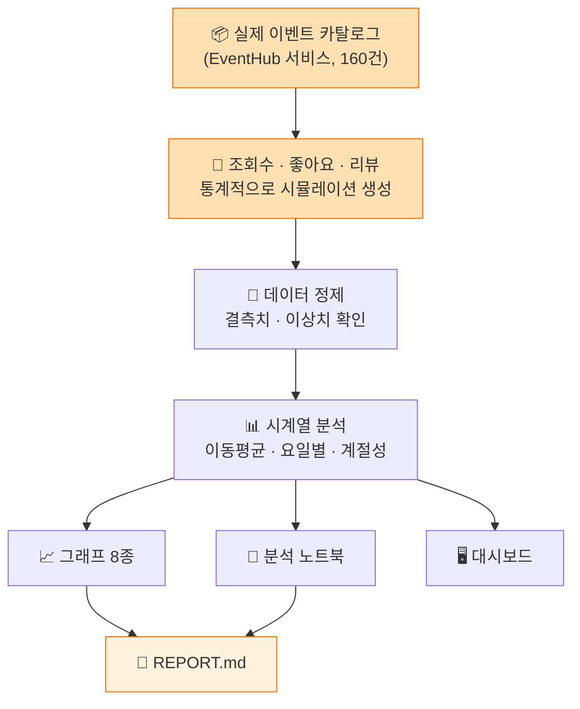
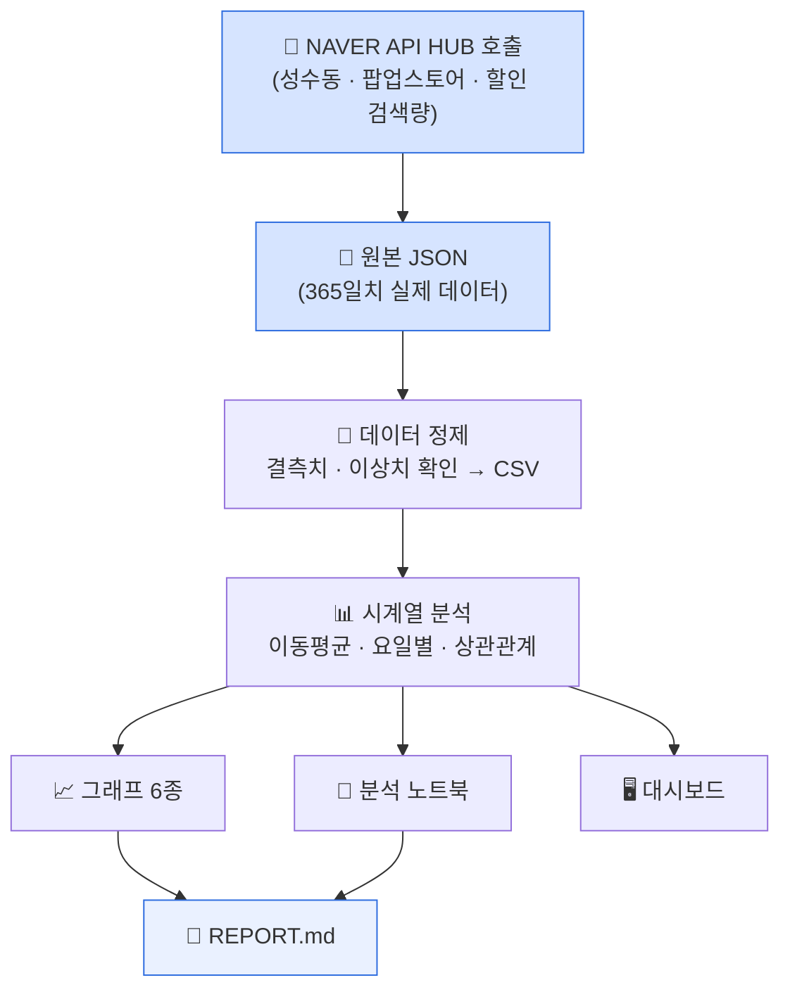

# EventHub 트렌드 분석 — 시뮬레이션 버전 + 실제 데이터 버전

> **[AI 데이터 분석] 데이터 기반 트렌드 분석** 미션 결과물
> 이 저장소 하나에 **분석 2개**가 들어있습니다. 아래에서 차이를 쉽게 설명드릴게요.

---

## 0. 이 저장소, 한마디로 뭔가요?

같은 과제를 **두 번** 했습니다. 이유는 이렇습니다:

- 처음 할 때는 EventHub가 아직 정식 오픈 전이라 실제 데이터가 없었어요. 그래서
  "진짜 데이터가 있다면 이럴 것이다"를 통계적으로 **시뮬레이션**해서 분석했습니다.
  → [`simulation-analysis/`](./simulation-analysis) 폴더
- 나중에 네이버에서 진짜 검색 데이터를 받을 수 있는 방법을 찾았어요. 그래서 이번엔
  **실제 데이터**(사람들이 네이버에서 "성수동"을 얼마나 검색했는지)로 똑같은 분석을
  다시 했습니다. → [`real-data-analysis/`](./real-data-analysis) 폴더

**두 분석 모두 각각 독립적으로 과제 요구사항을 전부 만족합니다** (아래 §9 체크리스트
참고). 시뮬레이션 버전은 "나중에 진짜 서비스가 커지면 이런 식으로 분석하면 된다"는
설계도 역할을 하고, 실제 데이터 버전은 "지금 당장 확인 가능한 진짜 사실"을 보여줍니다.

---

## 1. 🖥️ 대시보드 먼저 보기 (제일 쉬운 방법)

**아래 주소를 클릭하면 브라우저에서 바로 볼 수 있습니다.** 설치할 것도, 코드를
실행할 필요도 없어요.

### 👉 https://krasia45.github.io/trend-analysis-l/

접속하면 위쪽에 탭이 두 개 보입니다:
- **🏢 이벤트허브 가상 분석** — 가상의 EventHub 운영 데이터
- **🔍 네이버 성수 실측 분석** — 진짜 네이버 검색 트렌드

탭을 눌러가며 왔다갔다 비교해보실 수 있어요.

> ⚠️ **아직 위 주소가 안 열린다면?** GitHub Pages라는 기능을 한 번 켜줘야 합니다.
> §8에 3분이면 끝나는 방법을 적어뒀어요.

---

## 2. 두 분석의 차이 (한눈에 보기)

| | 🏢 이벤트허브 가상 분석 | 🔍 네이버 성수 실측 분석 |
|---|---|---|
| **폴더** | [`simulation-analysis/`](./simulation-analysis) | [`real-data-analysis/`](./real-data-analysis) |
| **데이터** | EventHub 실제 이벤트 카탈로그(160건) + 통계적으로 만든 가상 조회수·좋아요·리뷰 | 네이버 실제 검색어 트렌드 (성수동/팝업스토어/할인, 365일) |
| **진짜 데이터인가?** | ❌ 아니요, 시뮬레이션입니다 | ✅ 네, 실제 API로 받은 진짜 데이터입니다 |
| **왜 필요한가** | EventHub가 커지면 실제 데이터로 그대로 갈아끼울 수 있게 설계해둔 것 | 지금 당장 확인 가능한 성수동 상권의 실제 관심도 |
| **대시보드** | [docs/simulation/](./docs/simulation) | [docs/real-data/](./docs/real-data) |
| **리포트** | [simulation-analysis/REPORT.md](./simulation-analysis/REPORT.md) | [real-data-analysis/REPORT.md](./real-data-analysis/REPORT.md) |

---

## 3. 데이터 자세히 보기 — "이 숫자들이 정확히 뭔가요?"

과제를 이해하려면 "조회수", "좋아요", "리뷰수", "검색량 지수" 같은 용어가 정확히
뭘 뜻하는지부터 알아야 합니다. 하나씩 풀어서 설명드릴게요.

### 🏢 이벤트허브 가상 분석의 데이터 (조회수 · 좋아요 · 리뷰)

| 용어 | 뜻 | 이 분석에서의 실제 수치 |
|---|---|---|
| **조회수 (views)** | 사람들이 이벤트 상세 페이지를 몇 번 봤는지 | 112일 동안 **총 127,629회** (하루 평균 1,140회) |
| **좋아요 (likes)** | 사람들이 "마음에 든다"고 누른 횟수 | 112일 동안 **총 7,367개** (하루 평균 66개) |
| **리뷰 (reviews)** | 방문 후 남긴 후기 개수 | 112일 동안 **총 302건** |
| **평균 별점 (rating)** | 리뷰에 매긴 별점(1~5점)의 평균 | **4.2 / 5점** |

**중요**: 이 숫자들은 **전부 진짜가 아니라 통계적으로 만들어낸 것**입니다. EventHub가
아직 정식 오픈 전이라 "실제로 몇 명이 봤는지" 데이터가 없기 때문입니다. 대신 실제
이벤트 목록(브랜드, 할인율, 진행기간)은 진짜를 그대로 쓰고, "이 이벤트를 사람들이
얼마나 봤을지"만 아래 규칙으로 계산해서 만들었습니다:
- 주말엔 평일보다 더 많이 봤을 것이다 (실제로 1.37배 차이 나도록 설계)
- 할인율이 높을수록 더 많이 봤을 것이다
- 이벤트가 시작한 직후에 가장 관심이 높고, 시간이 지날수록 관심이 식는다
- 카테고리(푸드/뷰티/팝업 등)마다 인기도가 다르다

이렇게 "그럴듯한 규칙"으로 숫자를 만들었기 때문에, **개별 숫자 자체보다는 "패턴"이
중요합니다** — 예를 들어 "정확히 127,629번 봤다"는 사실이 아니지만, "주말에 더 많이
본다"는 패턴은 실제 서비스에서도 비슷하게 나타날 가능성이 높다는 뜻입니다.

### 🔍 네이버 성수 실측 분석의 데이터 (검색량 지수)

| 용어 | 뜻 | 이 분석에서의 실제 수치 |
|---|---|---|
| **검색량 지수 (ratio)** | 네이버에서 그 단어를 얼마나 검색했는지 나타내는 상대적인 점수(0~100점) | 아래 표 참고 |
| **성수동** | 지역 이름 검색 관심도 | 365일 평균 18.4점 (최고 100점, 최저 11.2점) |
| **팝업스토어** | 성수동의 대표 콘텐츠 키워드 | 365일 평균 9.0점 (최고 17.3점) |
| **할인** | EventHub의 핵심 가치 키워드 | 365일 평균 1.6점 (최고 3.2점) |

**중요**: "지수(ratio)"라는 표현이 핵심입니다. 이건 "정확히 몇 번 검색했다"가 아니라,
**"1년 중 검색이 제일 많았던 날을 100점이라고 했을 때, 다른 날은 몇 점인가"**를
나타내는 상대 점수입니다. 그래서 세 키워드끼리 점수를 직접 비교하면 안 됩니다 —
"성수동"과 "할인"은 각각 자기 자신의 최고치를 100으로 잡은 별개의 척도이기 때문에,
"성수동(18.4점)이 할인(1.6점)보다 11배 더 많이 검색됐다"라고 해석하면 틀립니다.
대신 "성수동은 시간에 따라 검색량이 이렇게 오르내리는구나" 처럼 **하나의 키워드
안에서의 변화 패턴**을 보는 데 쓰는 지표입니다.

이 데이터는 **가공하거나 지어낸 것이 전혀 없는 진짜 검색 기록**입니다 — 네이버가
공식으로 제공하는 API(NAVER API HUB Search Trend)를 통해 2026년 8월 25일에 실제로
받아왔습니다.

### 두 데이터를 나란히 보면

| | 조회수·좋아요·리뷰 (시뮬레이션) | 검색량 지수 (실제 데이터) |
|---|---|---|
| 무엇을 재는가 | EventHub 앱 안에서의 행동 | 네이버에서의 검색 행동 |
| 진짜인가? | ❌ 통계적으로 만든 것 | ✅ 실제 API로 받은 진짜 데이터 |
| 절대 수치를 믿어도 되나? | ❌ (패턴만 참고) | ❌ (지수도 상대값이라 패턴만 참고) |
| 기간 | 112일 (2026-05-01~08-20) | 365일 (2025-08-25~2026-08-25) |

---

## 4. 각 분석이 어떻게 만들어졌는지 궁금하다면

### 🏢 이벤트허브 가상 분석
EventHub의 실제 이벤트 목록(브랜드, 할인율, 진행기간 등 160건)은 진짜예요. 그런데
"사람들이 실제로 이걸 얼마나 봤는지"는 서비스 오픈 전이라 데이터가 없어서, 요일·
카테고리·할인율에 따라 조회수가 어떻게 변할지를 통계적으로 계산해서 만들었습니다.
자세한 계산 방법은 [simulation-analysis/README.md](./simulation-analysis/README.md)에
있습니다.



### 🔍 네이버 성수 실측 분석
[NAVER API HUB](https://www.ncloud.com/product/applicationService/naverApiHub)라는
네이버의 공식 서비스를 통해 "성수동", "팝업스토어", "할인" 세 단어를 사람들이 최근
1년간 얼마나 검색했는지 실제로 받아왔습니다. 이 데이터는 가공하거나 지어낸 것이
전혀 없는 진짜 검색 기록입니다. 자세한 내용은
[real-data-analysis/README.md](./real-data-analysis/README.md)에 있습니다
*(초보자 눈높이로 설명되어 있어요)*.



> 두 흐름도를 나란히 보면, **"데이터를 어디서 가져오느냐"만 다르고 그 뒤(정제→분석→
> 결과물)는 똑같은 방식**으로 진행된다는 걸 알 수 있어요. 이렇게 만들어서, 나중에
> EventHub가 진짜 운영되면 왼쪽(가상) 파이프라인을 오른쪽(실측) 방식으로 그대로
> 바꿔 끼울 수 있게 설계했습니다.

---

## 5. 사용한 기술 (초보자용, 표로 짧게)

이 과제에 어떤 기술이 쓰였는지 궁금하실 수 있어서, 최대한 쉬운 비유로 정리했습니다.

| 기술 | 한 줄 비유 |
|---|---|
| **Python** | 컴퓨터한테 "이거 해줘"라고 시키는 언어 (한국어 대신 이걸로 명령함) |
| **Pandas** | 엑셀처럼 표 데이터를 다루는 도구 (합계 내기, 정렬하기 등) |
| **Matplotlib** | 숫자를 그래프로 그려주는 도구 |
| **statsmodels** | 시계열 데이터를 "추세/계절성/예측" 관점에서 분석해주는 도구 |
| **Jupyter Notebook** | 코드랑 그 결과(그래프)를 한 화면에 같이 보여주는 노트 |
| **NAVER API HUB** | 네이버한테 "성수동 검색 얼마나 됐어?"라고 물어보면 답해주는 창구 |
| **HTML/CSS/JavaScript** | 웹페이지(대시보드)를 만드는 재료 — HTML은 뼈대, CSS는 꾸미기, JS는 클릭했을 때 반응 |
| **Chart.js** | 웹페이지 안에서 그래프가 마우스로 만지작거리게(인터랙티브하게) 해주는 도구 |
| **Git / GitHub** | 작업한 파일을 저장하고 백업해두는 창고 (구글 드라이브 같은 느낌) |
| **GitHub Pages** | 그 창고 안 파일을 인터넷 주소로 남들도 볼 수 있게 열어주는 기능 |

**한 줄로 요약하면**: Python으로 데이터를 정리하고(Pandas) → 그래프로 그리고
(Matplotlib) → 노트에 정리하고(Jupyter) → 웹페이지로도 만들어서(HTML/JS/Chart.js)
→ 창고(GitHub)에 올려서 → 인터넷 주소로 열어볼 수 있게(GitHub Pages) 한 것입니다.

---

## 6. 폴더 구조

```
trend-analysis-l/
├── README.md                  ← 지금 보고 계신 파일
├── docs/                       ← GitHub Pages가 여기를 웹사이트로 보여줍니다
│   ├── index.html                  대시보드 허브 (탭 전환 페이지)
│   ├── simulation/index.html       시뮬레이션 대시보드
│   └── real-data/index.html        실제 데이터 대시보드
│
├── simulation-analysis/       ← 첫 번째 분석 (가상 데이터)
│   ├── REPORT.md                   분석 리포트
│   ├── analysis.ipynb              분석 코드 (실행 결과 포함)
│   ├── dashboard.html              대시보드 원본 파일
│   ├── data/, images/, scripts/    데이터·그래프·코드
│   └── README.md                   이 분석만의 상세 설명
│
└── real-data-analysis/        ← 두 번째 분석 (실제 데이터)
    ├── REPORT.md                   분석 리포트
    ├── analysis.ipynb              분석 코드 (실행 결과 포함)
    ├── dashboard.html               대시보드 원본 파일
    ├── data/                       naver_search_trend_raw.json (원본) + 정제된 CSV
    ├── images/                     시각화 6종
    └── scripts/                    데이터 정제·시각화 코드
```

---

## 7. 내 컴퓨터에서 직접 실행해보고 싶다면 (초보자용)

대시보드는 그냥 열어보면 되지만, "코드가 진짜 이 결과를 만드는지" 직접 실행해보고
싶으시면 아래를 순서대로 따라 하세요. 처음 해보셔도 괜찮도록 각 단계에서 어떤
화면이 나와야 정상인지도 같이 적어뒀습니다.

### 7-1. 준비물 확인

- **Python 3.10 이상**이 설치되어 있어야 합니다. 터미널에 아래를 쳐서 확인하세요:
  ```bash
  python3 --version
  ```
  `Python 3.10.x` 이상이 나오면 OK입니다. 없다면
  [python.org/downloads](https://www.python.org/downloads/)에서 설치하세요.

### 7-2. 터미널 열기
- **Mac**: Spotlight(⌘+Space)에서 "터미널" 검색해서 실행
- **Windows**: 시작 메뉴에서 "PowerShell" 검색해서 실행

### 7-3. 저장소 받기
```bash
git clone https://github.com/krasia45/trend-analysis-l.git
cd trend-analysis-l
```
`git`이 없다는 에러가 나면 [git-scm.com](https://git-scm.com/downloads)에서 먼저
설치하세요.

### 7-4. 네이버 성수 실측 분석 실행해보기

```bash
cd real-data-analysis
python3 -m venv .venv
source .venv/bin/activate          # Windows는: .venv\Scripts\activate
pip install -r requirements.txt
```
설치가 끝나면 터미널 맨 앞에 `(.venv)`라는 표시가 붙습니다 — 정상적으로 가상환경에
들어왔다는 뜻입니다.

```bash
python3 scripts/clean_data.py
```
**예상 결과**: "저장 완료: .../naver_trend_daily.csv (shape=(365, 13))" 같은
문구가 뜨면 성공입니다. 원본 JSON 파일을 정제된 CSV(365행)로 바꾸는 단계입니다.

```bash
python3 scripts/analyze_and_visualize.py
```
**예상 결과**: "시각화 6종 생성 완료"라는 문구와 함께 몇 가지 통계 숫자가 출력됩니다.
`images/` 폴더를 열어보시면 방금 만들어진 그래프 6개(PNG 파일)가 보일 거예요.

이제 `REPORT.md`를 열어서 그 그래프들에 대한 설명과 인사이트를 읽어보시면 됩니다.

### 7-5. 노트북으로 한 번에 보고 싶다면
```bash
jupyter notebook analysis.ipynb
```
브라우저가 자동으로 열리면서 코드와 결과(그래프 포함)를 한 화면에서 순서대로 볼 수
있습니다. 이미 실행된 결과가 저장되어 있어서, 그냥 열기만 해도 그래프가 바로
보입니다. (직접 재실행하고 싶다면 상단 메뉴 **Kernel → Restart & Run All**)

### 7-6. 이벤트허브 가상 분석도 실행해보기

이벤트허브 가상 분석은 데이터를 만드는 과정 자체가 여러 단계로 나뉘어 있어서, **반드시
아래 순서대로** 실행해야 합니다 (뒤 단계가 앞 단계에서 만든 파일을 사용하기 때문).

```bash
cd ../simulation-analysis
python3 -m venv .venv && source .venv/bin/activate
pip install -r requirements.txt

python3 scripts/build_timeseries.py                    # ① 실제 카탈로그 → 일별 시계열 뼈대
python3 scripts/simulate_engagement_and_reviews.py      # ② 조회수·좋아요·리뷰 시뮬레이션 생성
python3 scripts/build_platform_daily.py                 # ③ ①②를 합쳐 최종 데이터셋 조립
python3 scripts/analyze_and_visualize.py                 # ④ 그래프 8개 생성
```
각 단계가 끝날 때마다 `data/` 폴더에 새 CSV 파일이 하나씩 늘어나는 걸 확인할 수
있습니다. 마지막 ④번까지 실행하면 `images/` 폴더에 그래프 8개가 생성됩니다.

[보너스] 1년 확장 시나리오까지 재현해보고 싶다면 이어서:
```bash
python3 scripts/simulate_extended_catalog.py
python3 scripts/build_extended_scenario.py
python3 scripts/analyze_extended_scenario.py
```

### 7-7. 자주 만나는 에러

| 에러 메시지 | 원인 | 해결 방법 |
|---|---|---|
| `command not found: python3` | 파이썬 미설치 | 7-1로 돌아가 파이썬 설치 |
| `No module named 'pandas'` (등) | 가상환경 활성화 안 됨 | `source .venv/bin/activate`를 다시 실행 (터미널 맨 앞에 `(.venv)`가 보여야 함) |
| `FileNotFoundError: ...csv` | 이전 단계를 건너뜀 | 7-6의 스크립트를 ①→②→③→④ 순서대로 전부 실행했는지 확인 |
| 한글 그래프가 네모(□)로 깨져 보임 | 한글 폰트 미설치 (리눅스) | `sudo apt-get install -y fonts-nanum` 실행 후 재시도 |

---

## 8. GitHub Pages 켜는 방법 (대시보드 주소가 아직 안 열릴 때만)

이 저장소를 갓 받으셨거나, §1의 주소가 아직 안 열린다면 딱 한 번 설정을 켜주셔야
합니다. 3분이면 끝나요.

1. GitHub에서 이 저장소(`krasia45/trend-analysis-l`) 페이지로 이동
2. 상단 메뉴에서 **"Settings"** 클릭
3. 왼쪽 메뉴에서 **"Pages"** 클릭
4. **"Build and deployment"** 항목에서:
   - Source: **"Deploy from a branch"** 선택
   - Branch: **"main"**, 폴더는 **"/docs"** 선택
5. **"Save"** 클릭
6. 1~2분 기다리면 페이지 상단에 초록색으로 **"Your site is live at
   https://krasia45.github.io/trend-analysis-l/"** 라고 뜹니다 — 그 주소로 들어가면
   대시보드가 보입니다.

---

## 9. 과제 요구사항 체크리스트

**이벤트허브 가상 분석과 네이버 성수 실측 분석 둘 다 각각 아래 요구사항을 전부 만족합니다.**

| 요구사항 | 🏢 이벤트허브 가상 | 🔍 네이버 성수 |
|---|---|---|
| 시계열 데이터 100개 이상 | ✅ 112일 | ✅ 365일 |
| 데이터 출처/기간 명시 | ✅ | ✅ |
| 분석 질문 3개 이상 | ✅ 4개 | ✅ 4개 |
| 데이터 정제(결측치/이상치) | ✅ | ✅ |
| 시계열 분석 기법 2개 이상 | ✅ 4개(이동평균/요일별/구간비교/경과일) | ✅ 4개(이동평균/요일별/월별/상관관계) |
| 시각화 2개 이상(권장 3개 이상) | ✅ 8종 | ✅ 6종 |
| 인사이트 3개 이상(근거 포함) | ✅ 3개 | ✅ 4개 |
| REPORT.md | ✅ | ✅ |
| Python 코드(노트북/스크립트) | ✅ | ✅ |
| GitHub 저장소 | ✅ (이 저장소) | ✅ (이 저장소) |
| 재현성(requirements.txt, 실행법) | ✅ | ✅ |
| AI 사용 로그 | ✅ | ✅ |
| **[보너스] 서비스화(대시보드)** | ✅ | ✅ |
| **[보너스] 시계열 심화(분해/예측)** | ✅ | ✅ |
| (추가) 실서비스 전환 경로 설계 | ✅ (`simulation-analysis/README.md` §5, 실측 데이터로 갈아끼우는 절차 준비) | — (이미 실측이라 해당 없음) |
| (추가) 두 분석 통합 대시보드 | ✅ 하나의 대시보드에서 탭으로 전환 가능 | ✅ 하나의 대시보드에서 탭으로 전환 가능 |

세부 항목별 근거는 각 폴더의 REPORT.md에서 확인할 수 있습니다.

---

## 10. 데이터 출처 및 라이선스

- **이벤트허브 가상 분석 원본**: EventHub 실제 이벤트 카탈로그
  ([github.com/krasia45/eventhub](https://github.com/krasia45/eventhub)의
  `seed_events.json`, 2026-08-20 기준 스냅샷, 160건). 조회수·좋아요·리뷰는 이 원본을
  바탕으로 만든 통계적 시뮬레이션이며 실측이 아니다.
- **네이버 성수 실측 분석 원본**: NAVER API HUB Search Trend API로 2026-08-25에 수집한
  실제 검색어 트렌드. 네이버 오픈 API 이용약관에 따라 제공되는 상대 검색량 지수이며,
  원본 검색 로그나 재판매 목적의 재배포는 허용되지 않는다.
- 이 저장소는 학습/과제 제출 목적의 분석이며, EventHub 서비스 본체
  (`krasia45/eventhub`)의 프로덕션 코드와는 별도로 관리된다.
