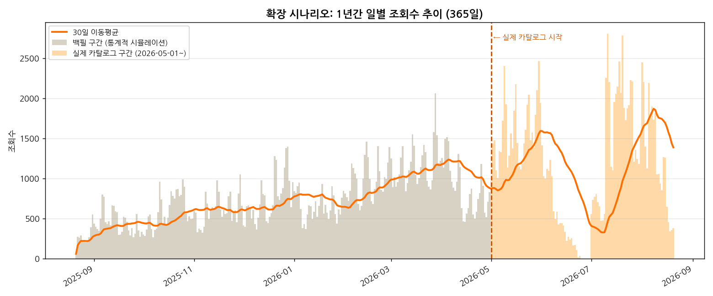

# EventHub 관심도 인텔리전스 — 일별 트렌드 분석

> **[AI 데이터 분석] 데이터 기반 트렌드 분석** 미션 결과물
> "EventHub가 실제로 운영되고 있다면, 사람들은 지금 무엇에 관심이 있을까?"를
> 실제 이벤트 카탈로그 + 시뮬레이션 관심도 데이터로 분석한다.

📄 **분석 리포트**: [`REPORT.md`](./REPORT.md)
📓 **분석 코드(노트북, 실행결과 포함)**: [`analysis.ipynb`](./analysis.ipynb)
🖥️ **인터랙티브 대시보드**: [`dashboard.html`](./dashboard.html) — 스크린샷: [`docs/DASHBOARD_SCREENSHOTS.md`](./docs/DASHBOARD_SCREENSHOTS.md)
🛠️ **실서비스 전환 준비물**: [`sql/production_schema_additions.sql`](./sql/production_schema_additions.sql) · [`scripts/fetch_real_data_from_supabase.py`](./scripts/fetch_real_data_from_supabase.py)

---

## 0. 요구사항 충족 현황

필수 요구사항(데이터 100개 이상, 질문 3개 이상, 정제, 기법 2개 이상, 시각화 2개
이상, 인사이트 3개 이상, REPORT.md, 코드, 재현성, AI 사용 로그)과 보너스 두 가지
(서비스화, 시계열 심화)를 모두 충족한다. 항목별 근거는 §9 체크리스트 참고.

이 리포트의 조회수·좋아요·리뷰는 시뮬레이션 데이터다 — EventHub가 정식 오픈 전이라
실측 데이터가 아직 없기 때문이다. 실제 EventHub Supabase 스키마를 검토한 결과,
`event_stats` 테이블은 조회수/좋아요의 누적 총합만 저장하고 날짜별 기록이 없어
현재 구조로는 실측 데이터를 넣어도 "일별 추이"를 만들 수 없다. 이 격차를 메우는
추가 스키마(`sql/production_schema_additions.sql`)와 실데이터 어댑터
(`scripts/fetch_real_data_from_supabase.py`)를 함께 준비했다 — 두 가지를 적용하면
분석 파이프라인의 나머지 코드는 수정 없이 실측 데이터로 재실행된다 (§5).

추가로 구현한 고도화 사항:
1. **데이터 폭 확장** — "1년간 운영했다면" 시나리오. 실제 160건은 그대로 두고
   그 이전 253일을 실제 데이터의 경험적 분포로 통계적 백필해 401건·365일로 확장 (§6)
2. **실서비스 전환 경로** — SQL 마이그레이션 + Supabase 어댑터 + self-test (§5)
3. **대시보드 오프라인화** — Chart.js를 CDN이 아니라 파일에 직접 내장(vendoring),
   템플릿/데이터 분리로 재생성 자동화 (§4)
4. **대시보드 필터 시나리오 3종**을 헤드리스 브라우저로 렌더링한 스크린샷 증빙
5. 이전 팀 프로젝트(`review_dashboard`)의 리뷰 감정분석 방식을 재사용 — 별점 기반
   감정과 키워드 기반 감정을 이중 산출해 교차 검증
6. **파이프라인 이식성**: 전체 스크립트가 상대경로(`Path(__file__).resolve()...`)
   기준으로 동작해, 어느 경로에 clone해도 동일하게 재현된다 (§8-4)

---

## 1. 데이터 접근 방법

EventHub는 2026년 8월 현재 정식 오픈 전(가동 준비 중) 상태라 실측 트래픽이 없다.
분석 대상 시계열로 EventHub와 무관한 데이터(주가, 날씨 등)를 쓰는 대신 아래 방식을
택했다:

1. EventHub의 **실제 이벤트 카탈로그**(`github.com/krasia45/eventhub`의
   `seed_events.json`, 160건 — 실제 카테고리/브랜드/할인율/진행기간 값)를 데이터의
   뼈대로 삼는다.
2. "서비스가 실제로 운영되고 있다면"이라는 가정 하에, 그 카탈로그를 사람들이 보고
   좋아요를 누르고 리뷰를 남기는 과정을 통계적으로 시뮬레이션한다.
3. 팀 프로젝트 `review_dashboard`(리뷰 감정분석 대시보드)의 접근 방식(별점 vs 텍스트
   키워드 기반 감정을 이중 산출해 교차 검증)을 리뷰 시뮬레이션에 재사용해, "리뷰"
   데이터 유형도 분석에 포함한다.

이 방식은 EventHub의 실제 사업 모델("지금 사람들이 무엇에 관심 있는지 데이터로
짚어 기업/소상공인에게 인사이트로 제공")을 데이터로 미리 시연한다. 실제 데이터와
시뮬레이션 데이터의 경계는 REPORT.md·README·대시보드 세 곳 모두에 명시되어 있다.

---

## 2. 전체 파이프라인 아키텍처

```
┌─────────────────────────────────────────────────────────────────┐
│  A. 실제 데이터                                                    │
│  eventhub_seed_events_raw.json (160건, EventHub 실제 카탈로그)      │
└───────────────────────────┬───────────────────────────────────────┘
                             ▼
                  scripts/build_timeseries.py
                  (레코드 → 일별 시계열, 결측치/이상치 점검)
                             ▼
              data/eventhub_daily_timeseries.csv  (112일)
                             │
                             ▼
        scripts/simulate_engagement_and_reviews.py
        (B. 시뮬레이션: 카테고리 가중치·요일 계수·노벨티 감쇠·
         할인율 효과 기반 조회수/좋아요/리뷰 생성, 시드 고정)
                             │
        ┌────────────────────┴────────────────────┐
        ▼                                          ▼
data/..._event_daily_engagement.csv       data/..._reviews_simulated.csv
        └────────────────────┬────────────────────┘
                             ▼
              scripts/build_platform_daily.py
              (병합 + 7일 가중평균 별점 등 지표 계산)
                             ▼
           data/eventhub_platform_daily.csv  ★ 최종 분석 데이터셋
                             │
         ┌───────────────────┼───────────────────────┐
         ▼                   ▼                        ▼
scripts/analyze_and_    scripts/make_notebook.py   scripts/build_dashboard.py
visualize.py            → analysis.ipynb              (templates/dashboard_
→ images/*.png 8종       (nbconvert --execute로       template.html + Chart.js
  + 시계열분해 + 예측       결과 내장)                   vendoring)
                                                          ▼
                                                    dashboard.html
                                                    (완전 오프라인 동작)

─────────────────────────────────────────────────────────────────────
C. 실서비스 전환 경로 (오픈 후, 위 B를 대체)
─────────────────────────────────────────────────────────────────────
sql/production_schema_additions.sql  (Supabase에 1회 적용)
             │
             ▼
scripts/fetch_real_data_from_supabase.py
(실측 events/event_stats_daily/event_visits → 동일 스키마로 reshape)
             │
             ▼
data/eventhub_platform_daily_REAL.csv   ← 위 "최종 분석 데이터셋"과 완전히 동일한 컬럼
             │
             ▼
   (analyze_and_visualize.py / make_notebook.py / build_dashboard.py 를
    입력 경로만 바꿔서 재실행 → 코드 수정 없이 실측 데이터로 전체 리포트 재생성)
```

**설계 원칙**: B(시뮬레이션)와 C(실데이터)가 동일한 출력 스키마
(`eventhub_platform_daily.csv`)를 만들어내도록 설계했다. 데이터 소스가 바뀌어도
그 뒤(시각화·노트북·대시보드) 코드는 손댈 필요가 없다.

---

## 3. 시뮬레이션 방법론 (요약 — 전체 가정은 REPORT.md §3, 코드 주석 참고)

`scripts/simulate_engagement_and_reviews.py`의 핵심 가정:

| 요소 | 가정 |
|---|---|
| 카테고리 가중치 | 푸드(1.30) > 팝업(1.25) > 뷰티(1.15) > 패션(1.10) > 딜리버리(1.00) > 리빙(0.85) > 테크(0.80) > 스테이(0.75) |
| 요일 계수 | 토(1.35) > 일(1.25) > 금(1.15) > 목(0.95) ≈ 수(0.90) ≈ 월(0.90) > 화(0.85) |
| 노벨티 감쇠 | `0.5 + 0.85·exp(-경과일/4)` — 시작 직후 최고, 이후 지수적으로 감쇠해 바닥 0.5배 수렴 |
| 할인율 효과 | 정률 할인 30% 기준 중립, 높을수록(최대 1.9배) 관심 증가 / 1+1·사은품형은 중립값 |
| 좋아요 전환율 | 카테고리별 4.0~7.5% (조회수 대비) |
| 별점 | 카테고리 기본 만족도(3.8~4.15) + 할인 매력도 보정 + 정규분포 잡음, 1~5 반올림 |
| 재현성 | `np.random.default_rng(42)` 고정 시드 — 동일 입력이면 항상 동일 출력 |

**리뷰 텍스트 + 이중 감정 라벨링** (review_dashboard 프로젝트 방식 재사용):
- 별점 구간(긍정≥4 / 중립=3 / 부정≤2)에 맞는 한국어 문장 템플릿 풀에서 생성
  (10%는 의도적으로 톤을 섞어 현실적 잡음 반영)
- `rating_sentiment`(별점 기반)와 `text_sentiment`(키워드 규칙 기반, POS_LEX/NEG_LEX)를
  각각 독립적으로 계산해 일치율 88.3%를 교차 검증 지표로 제시

---

## 4. 대시보드 구현

대시보드는 외부 CDN 의존성 없이 완전히 오프라인으로 동작하도록 구현되어 있다.
Chart.js UMD 번들(`npm pack chart.js@4.4.4`)을 `dashboard.html` 안에 직접
인라인(vendoring)해, 인터넷 연결 없이도 항상 동일하게 작동한다 (부수 효과로 CDN
장애/차단에도 영향받지 않는다). Playwright(Chromium 헤드리스) 렌더링으로 콘솔 에러
0건, 필터 클릭 시 차트 정상 갱신을 확인했다 (`docs/DASHBOARD_SCREENSHOTS.md`).

**구조 분리**: `templates/dashboard_template.html`(placeholder 포함) +
`scripts/build_dashboard.py`(데이터 주입)로 나눠서, 데이터 소스가 시뮬레이션→실측으로
바뀌어도 `--daily`, `--mode real` 인자만 바꿔 재실행하면 대시보드가 자동으로
"LIVE DATA" 배지로 전환된다 (§2 다이어그램의 C 경로).

---

## 5. 실서비스 전환 가이드

### 5-1. 실제 EventHub 스키마로 무엇이 되고, 무엇이 안 되는가

`krasia45/eventhub`의 `schema.sql` 기준:

| 테이블 | 있는 것 | 이 분석에 필요하지만 없는 것 |
|---|---|---|
| `event_stats` | 이벤트별 조회수·좋아요 누적 총합 | 날짜별 기록 (일별 시계열 불가) |
| `event_visits` | 방문 후기 자유 텍스트(`comment`) | 별점(`rating`) 컬럼 |
| (cron) | 후보 스캔(주1회), 링크 점검(일1회) | 통계 스냅샷 cron 없음 |

즉 지금 당장 실측 데이터를 연결해도 이 리포트와 같은 "일별 조회수 추이"는 만들 수
없다 — 누적 카운터에는 시간 정보가 없기 때문이다.

### 5-2. 격차를 메우는 준비물

**`sql/production_schema_additions.sql`** (Supabase SQL Editor에서 1회 실행, idempotent):
- `event_stats_daily(event_id, stat_date, views, likes, site_visits)` 테이블 신설 —
  매일 1회 `event_stats`의 누적값을 스냅샷으로 복사해 쌓는다.
- `snapshot_event_stats_daily()` 함수 — cron이 매일 호출하면 위 스냅샷을 만든다.
- `event_visits.rating` 컬럼 추가 (1~5, nullable — 기존 텍스트 후기와 호환).
- SQL 파일 하단에 코드 쪽에서 남은 작업(cron 등록, 후기 폼에 별점 UI 추가)을 안내.

**`scripts/fetch_real_data_from_supabase.py`**:
- `SUPABASE_URL` / `SUPABASE_SERVICE_ROLE_KEY` 환경변수로 접속 (기존 `seed_import.py`와
  동일한 변수명).
- `events`, `event_stats_daily`, `event_visits`를 읽어 `eventhub_platform_daily.csv`와
  완전히 동일한 컬럼 스키마로 재조립.
- 스냅샷이 아직 1일치뿐이거나 마이그레이션이 안 됐으면 무엇이 부족한지 안내하고
  안전하게 종료.
- `--self-test`: 네트워크 없이 합성 fixture로 reshape 로직(일별 신규 조회수 = 오늘
  누적 − 어제 누적, 리뷰 집계 등)의 정확성을 assertion으로 검증한다. 실제 Supabase
  인스턴스로의 라이브 연결은 별도 검증이 필요하다 — 로직 정확성만 self-test로
  보증한다.

### 5-3. 오픈 후 실행 순서 (미래 시점)

```bash
# 1) Supabase SQL Editor에 sql/production_schema_additions.sql 적용
# 2) api/cron_jobs.py 에 스냅샷 job 추가 (SQL 파일 하단 안내 참고), 2~3주 데이터 축적
# 3) 실데이터 가져오기
export SUPABASE_URL=https://xxx.supabase.co
export SUPABASE_SERVICE_ROLE_KEY=xxx
python3 scripts/fetch_real_data_from_supabase.py
#    → data/eventhub_platform_daily_REAL.csv 생성

# 4) 기존 분석 파이프라인을 입력만 바꿔 재실행
python3 scripts/analyze_and_visualize.py   # (내부 경로를 _REAL.csv로 수정)
python3 scripts/build_dashboard.py --daily data/eventhub_platform_daily_REAL.csv \
    --mode real
#    → dashboard.html이 "LIVE DATA" 배지로 자동 전환되어 재생성됨
```

---

## 6. 데이터 폭 확장 — "1년간 운영했다면" 시나리오

### 6-1. 배경

본문 분석(§1~5)은 실제 카탈로그 그대로인 112일(160건)에 근거한다. 이 폭에는 두
가지 한계가 있다: 월별 계절성을 볼 수 없고(112일 = 약 3.7개월), 카테고리당 표본이
20건뿐이라 트렌드 지표(REPORT.md §6 인사이트 2)가 관측 시점에 따라 크게 흔들린다.

### 6-2. 방법 — 실제 데이터를 유지한 채 시간축으로만 확장

실제 160건을 수정하지 않고 그대로 보존한 채, 그 이전 253일(2025-08-21~2026-04-30)
구간만 실제 데이터의 경험적 분포로 통계적으로 백필했다.

```
┌───────────────────────────────┬─────────────────────────────────┐
│ 2025-08-21 ~ 2026-04-30 (253일) │ 2026-05-01 ~ 2026-08-20 (112일)  │
│ 백필 — 실제 160건에서 추정한      │ 실제 카탈로그 그대로 (160건,        │
│ 경험적 분포로 시뮬레이션 생성       │ 100% 실측, 수정 없음)              │
└───────────────────────────────┴─────────────────────────────────┘
```

백필 이벤트의 카테고리별 할인율 분포·진행기간 분포·소상공인 비율·브랜드 풀은 실제
160건에서 부트스트랩 추정했다 (`scripts/simulate_extended_catalog.py`). 신규 이벤트
유입률은 초기 0.5건/일 → 실제 구간 진입 시점 관측값(1.43건/일)까지 선형 증가하도록
설계했다 — 초기 스타트업이 이벤트 소싱 파이프라인을 늘려온 성장 곡선이라는 가정이며,
검증되지 않은 가정임을 명시한다.

결과: **401건 · 365일**로 확장 (원본 대비 데이터 폭 3.3배).



### 6-3. 가설 검증 — 예측 성능은 데이터 양이 아니라 공급 연속성에 좌우되는가

REPORT.md §5-8에서 세운 가설("신규 이벤트가 지속적으로 유입되면 예측이 더 안정적일
것")을 확장된 데이터로 검증했다. 단순히 원본과 확장 전체만 비교하면 공정하지 않다
— 백필이 과거 방향으로만 확장됐기 때문에, 8월 말단부의 "신규 이벤트가 끊기는" 문제는
확장 데이터에도 그대로 남아있다. 그래서 연속 공급이 보장된 중간 구간까지 포함한
3-way 비교로 설계했다.


| 구간 | MAPE |
|---|---|
| ① 원본(112일) 말단 | 86.4% |
| ② 확장(365일) 말단 — 8월 공급단절 여전 | 89.9% |
| ③ 확장(365일) 중간 — 연속 공급 보장 | **24.5%** |

**결론**: "데이터가 많으면 예측이 좋아진다"가 아니라 "공급이 끊기지 않는 구간에서만
예측이 안정적이다"가 정확한 결론이다. 표본 크기 자체보다 데이터의 구조적 연속성이
핵심이라는, 원래 가설보다 한 단계 더 정교한 결과다.

### 6-4. 월별 추이


### 6-5. 확장 시나리오의 한계

- 백필 구간은 통계적 시뮬레이션이며 실측이 아니다.
- 성장 곡선 가정(0.5→1.43건/일 선형 증가)은 검증되지 않았다.
- 카테고리 트렌드 안정성 비교(원본 28일 창 vs 확장 90일 창)는 비교 구간 길이 자체가
  달라서 "표본이 크면 안정된다"는 엄밀한 통제 실험이 아니다 — "작은 표본 스냅샷의
  트렌드는 관측 시점에 따라 크게 흔들린다"는 정성적 근거로만 해석한다
  (`scripts/analyze_extended_scenario.py` 실행 로그 참고).
- 가장 신뢰할 수 있는 데이터는 여전히 실제 160건·112일이다. 확장 시나리오는
  "데이터가 더 있었다면 어떤 분석이 가능해지는지"를 보여주는 시뮬레이션이며, 실제
  부족분을 메우는 근본 해법은 §5의 경로로 실측 데이터를 쌓는 것이다.

전체 실행 순서:
```bash
python3 scripts/simulate_extended_catalog.py   # 확장 카탈로그 생성 (401건)
python3 scripts/build_extended_scenario.py     # 관심도/리뷰 시뮬레이션 재실행 (365일)
python3 scripts/analyze_extended_scenario.py   # 시각화 4종 + 가설 검증
```

---

## 7. 폴더 구조

```
eventhub-trend-analysis/
├── REPORT.md                          ← 최종 분석 리포트 (필수 결과물)
├── README.md                          ← 이 문서
├── requirements.txt
├── analysis.ipynb                     ← 분석 노트북 (실행 결과 포함, 필수 결과물)
├── dashboard.html                     ← 인터랙티브 대시보드 (보너스: 서비스화, 완전 오프라인)
├── templates/
│   └── dashboard_template.html        ← 대시보드 소스 템플릿 (placeholder 포함)
├── sql/
│   └── production_schema_additions.sql ← 실서비스 전환용 추가 스키마 (제안)
├── data/
│   ├── eventhub_seed_events_raw.json  ← 원본 (EventHub 실제 이벤트 카탈로그, 160건)
│   ├── eventhub_events_clean.csv      ← 정제된 이벤트 테이블
│   ├── eventhub_daily_timeseries.csv  ← 카탈로그 기반 일별 시계열 (활성/신규 이벤트 수 등)
│   ├── eventhub_event_daily_engagement.csv  ← 이벤트×일 단위 시뮬레이션 조회수/좋아요
│   ├── eventhub_reviews_simulated.csv ← 시뮬레이션 리뷰(별점/텍스트/감정)
│   ├── eventhub_platform_daily.csv    ← ★ 최종 분석 데이터셋 (112일 × 41개 지표)
│   ├── eventhub_events_extended.csv        ← [고도화] 확장 카탈로그 (401건, is_real 컬럼)
│   ├── eventhub_event_daily_engagement_extended.csv
│   ├── eventhub_reviews_extended.csv
│   └── eventhub_platform_daily_extended.csv ← [고도화] 확장 최종 데이터셋 (365일)
├── images/                            ← 시각화 8종 (PNG)
│   └── extended/                      ← [고도화] 1년 확장 시나리오 시각화 4종
├── docs/
│   ├── DASHBOARD_SCREENSHOTS.md       ← 보너스: 대시보드 필터 시나리오 + 스크린샷
│   └── screenshots/*.png              ← 헤드리스 브라우저로 촬영한 실제 작동 화면 3종
└── scripts/                           ← 데이터 파이프라인 스크립트 (실행 순서대로)
    ├── build_timeseries.py            (1) 카탈로그 → 일별 시계열
    ├── simulate_engagement_and_reviews.py  (2) 관심도/리뷰 시뮬레이션
    ├── build_platform_daily.py        (3) 최종 데이터셋 조립
    ├── analyze_and_visualize.py       (4) 시각화 8종 + 분해 + 예측
    ├── make_notebook.py               (5) analysis.ipynb 생성
    ├── build_dashboard.py             (6) dashboard.html 조립 (템플릿 + 데이터)
    ├── fetch_real_data_from_supabase.py  [실서비스 전환용] 실측 데이터 어댑터
    ├── _vendor_chart.umd.js           Chart.js 번들 (build_dashboard.py가 내장용으로 사용)
    ├── simulate_extended_catalog.py   [고도화] 1년 확장 카탈로그 생성 (§6)
    ├── build_extended_scenario.py     [고도화] 확장 카탈로그 관심도/리뷰 시뮬레이션 재실행
    └── analyze_extended_scenario.py   [고도화] 확장 시나리오 시각화 + 가설 검증
```

---

## 8. 실행 방법

### 8-1. 환경 설정
**요구 사항**: Python 3.10 이상
```bash
python3 --version   # 3.10 이상 확인
python3 -m venv .venv && source .venv/bin/activate   # 선택 사항
pip install -r requirements.txt
sudo apt-get install -y fonts-nanum   # 한글 폰트 (matplotlib 한글 깨짐 방지)
```

### 8-2. 전체 파이프라인 재현 (시뮬레이션 데이터 기준)
```bash
python3 scripts/build_timeseries.py
python3 scripts/simulate_engagement_and_reviews.py
python3 scripts/build_platform_daily.py
python3 scripts/analyze_and_visualize.py
python3 scripts/make_notebook.py
jupyter nbconvert --to notebook --execute --inplace analysis.ipynb
python3 scripts/build_dashboard.py

# [고도화] 1년 확장 시나리오 (§6) — 위 파이프라인 실행 후 추가로:
python3 scripts/simulate_extended_catalog.py
python3 scripts/build_extended_scenario.py
python3 scripts/analyze_extended_scenario.py
```

### 8-3. 결과 확인
- `REPORT.md`를 열어 리포트를 읽는다 (이미지가 `images/`를 상대경로로 참조).
- `analysis.ipynb`를 Jupyter로 열면 코드+실행 결과(차트 포함)를 바로 볼 수 있다.
- `dashboard.html`을 브라우저로 더블클릭해서 열면 완전 오프라인으로 바로 작동한다.
  "전체 112일" 탭이 기본값이며, "최근 4주" 탭을 누르면 REPORT.md §5-4·§6에 인용된
  카테고리 증감률 수치와 정확히 일치하는 값을 볼 수 있다.
- `docs/DASHBOARD_SCREENSHOTS.md`에서 3가지 필터 시나리오 스크린샷을 바로 확인 가능.

### 8-4. 재현성

모든 스크립트는 `Path(__file__).resolve().parent.parent` 기준 상대경로로 파일을
찾기 때문에, 이 폴더를 어디에 복사하거나 clone해도 동일하게 동작한다. 별도 경로에
복사한 뒤 8-2의 9단계 스크립트와 `jupyter nbconvert --execute`까지 처음부터 다시
실행해 결과(데이터 9개, 이미지 12개, 노트북 38셀 0에러, 대시보드)가 재생성되는 것을
검증했다.

---

## 9. 과제 요구사항 체크리스트

| 요구사항 | 충족 여부 |
|---|---|
| 시계열 데이터 100개 이상 | ✅ 112일 (2026-05-01~08-20) |
| 데이터 출처/기간 명시 | ✅ REPORT.md §3 |
| 분석 질문 3개 이상 | ✅ 4개 |
| 데이터 기본 정보/결측치/이상치 처리 | ✅ REPORT.md §4 |
| 시계열 분석 기법 2개 이상 | ✅ 이동평균·요일별 집계·구간비교·경과일 분석 (4개) |
| 시각화 2개 이상(권장 3개 이상) | ✅ 8종 |
| 인사이트 3개 이상(관찰 근거 포함) | ✅ 5개 |
| REPORT.md (주제/질문/데이터/시각화/인사이트/결론) | ✅ |
| Python 코드 (노트북 또는 스크립트) | ✅ `analysis.ipynb` + `scripts/*.py` 8개 |
| GitHub 저장소 | ✅ |
| 재현성(requirements/실행방법) | ✅ §8 |
| AI 사용 투명성 로그 | ✅ REPORT.md §8 |
| [보너스] 서비스화(대시보드) | ✅ `dashboard.html` + 스크린샷 3종 |
| [보너스] 시계열 심화(분해/예측) | ✅ REPORT.md §5-7, §5-8 |
| (추가 고도화) 실서비스 전환 경로 | ✅ SQL 마이그레이션 + 어댑터 + self-test |
| (추가 고도화) 데이터 폭 확장(1년 시나리오) | ✅ §6, REPORT.md 부록 E — 가설 검증 포함 |

---

## 10. 알려진 제한사항

- 조회수·좋아요·리뷰는 시뮬레이션이다. §3의 가정은 실제 데이터를 근거로 설계했지만
  실측은 아니다 — 절대 수치가 아니라 패턴을 참고 자료로 해석해야 한다.
- `fetch_real_data_from_supabase.py`는 reshape 로직을 self-test로 검증했지만, 실제
  Supabase 인스턴스로의 라이브 연결은 별도 검증이 필요하다.
- REPORT.md §6 인사이트 4("6일간 이벤트 공급 공백")는 시뮬레이션이 아니라 원본
  카탈로그 자체에서 나온 사실이다 — 서비스 오픈 전 검토할 가치가 있는 실측 기반
  발견이다.

---

## 11. 데이터 출처 및 라이선스

- **원본 데이터**: `data/eventhub_seed_events_raw.json`(160건)은
  [github.com/krasia45/eventhub](https://github.com/krasia45/eventhub)의
  `seed_events.json`(2026-08-20 기준 스냅샷)을 그대로 가져온 것이다. 브랜드명·할인
  조건은 EventHub 서비스의 MVP 시연을 위해 구성된 콘텐츠이며, 이미지 URL
  (`picsum.photos`)은 개발용 플레이스홀더로 실제 브랜드의 공식 이벤트 페이지가
  아니다.
- **파생 데이터**(`data/eventhub_*_extended.csv`, `*_simulated.csv` 등)는 위 원본을
  입력으로 한 통계적 시뮬레이션 산출물이며, 이 저장소 자체 라이선스(별도 명시 없으면
  분석 코드는 자유롭게 재사용 가능)를 따른다.
- 이 저장소는 학습/과제 제출 목적의 파생 분석이며, EventHub 서비스 본체
  (`krasia45/eventhub`)의 프로덕션 코드와는 별도로 관리된다.
