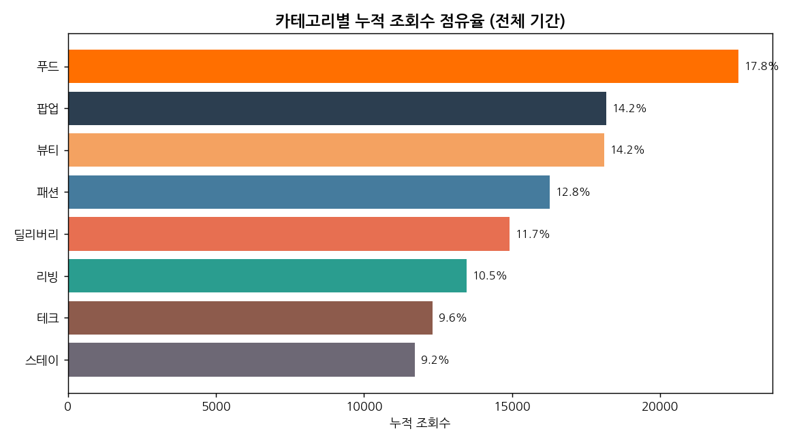
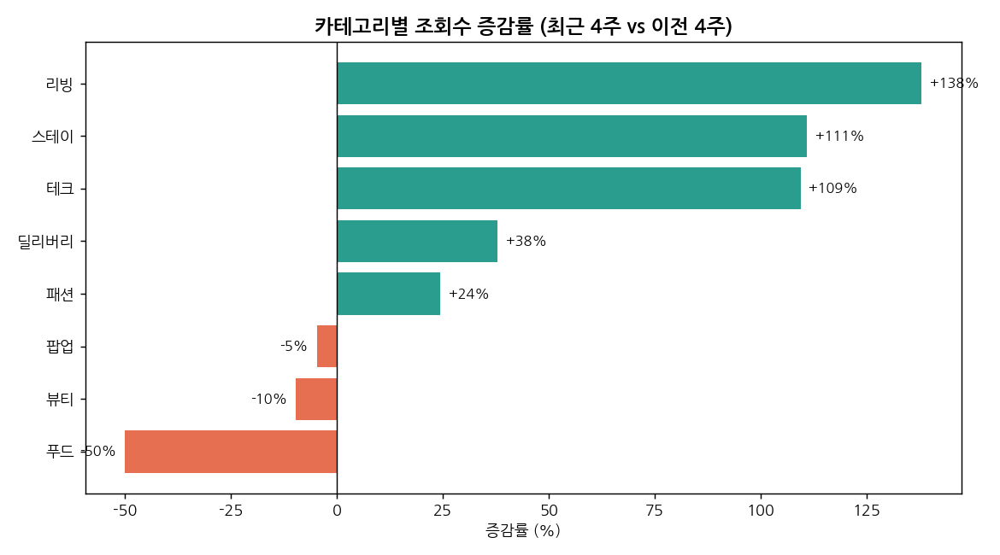
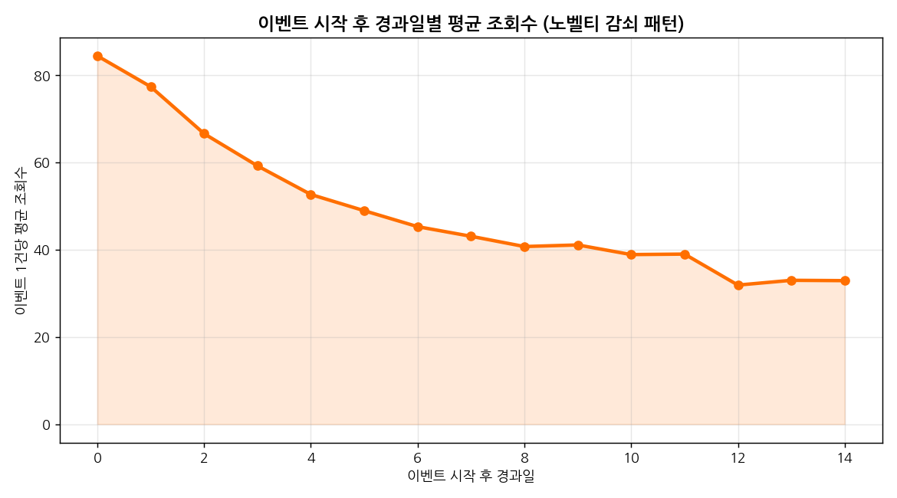
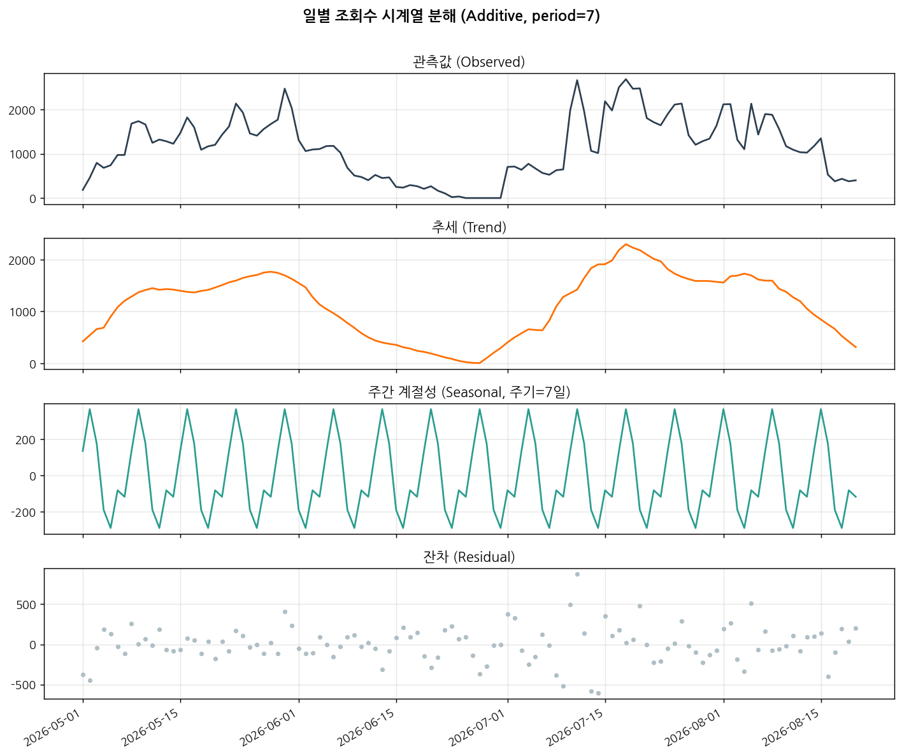
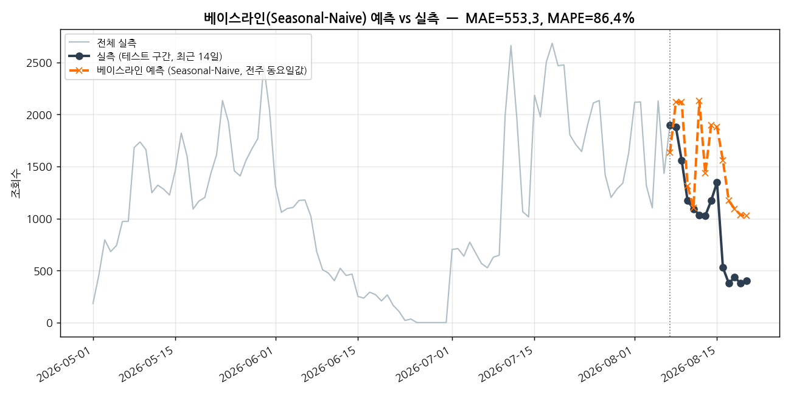

# EventHub 일별 관심도(조회수) 트렌드 분석 리포트

> AI 데이터 분석: 데이터 기반 트렌드 분석 — 미션 결과물

---

## 1. 분석 주제 및 선정 이유

**주제**: "만약 EventHub가 지금 실제로 운영되고 있다면, 사람들은 어떤 할인 이벤트에 관심을
갖고 있을까?" — 플랫폼 일별 조회수·좋아요·리뷰(별점) 시계열 분석

EventHub는 소비자·기업·소상공인·외국인 관광객을 연결하는 4면 discount-event 플랫폼으로,
"브랜드별 전수 큐레이션과 실시간 인기 랭킹"을 핵심 가치로 제공하는 것을 목표로 한다.
즉 **"지금 사람들이 무엇에 관심 있는지"를 데이터로 짚어내 기업/소상공인에게 인사이트로
되돌려주는 것**이 서비스의 핵심 경쟁력이다.

다만 2026년 8월 현재 EventHub는 정식 오픈 전(가동 준비 중) 단계라 실측 트래픽이 없다.
그래서 이 분석은 **실제 이벤트 카탈로그(`seed_events.json`, GitHub `krasia45/eventhub`,
160건)를 입력으로 삼아, "서비스가 실제로 돌아가고 있다면" 발생했을 법한 사용자 관심도를
통계적으로 시뮬레이션**하고, 그 시계열을 분석했다. 카테고리, 브랜드, 할인율, 진행 기간은
모두 실제 카탈로그 값이며, 조회수·좋아요·리뷰만 시뮬레이션이다 — 이 구분을 §3, §7에서
투명하게 밝힌다.

---

## 2. 분석 질문 (4개)

1. 플랫폼 전체 **일별 조회수**는 어떤 추세와 요일 패턴을 보이는가?
2. 어떤 **카테고리가 최근 상승세(트렌딩)**를 보이는가? — 기업에게 어떤 카테고리·타이밍에
   프로모션을 제안할 수 있는가?
3. 이벤트 시작 이후 관심도는 **어떻게 감쇠**하는가(노벨티 효과)? 이벤트 운영 전략(리마인드
   알림 등)에 어떤 시사점을 주는가?
4. 리뷰 데이터의 **만족도(별점)**는 카테고리별로 다른가? 관심도(조회수)와 만족도(평점) 사이에
   상관관계가 있는가?

---

## 3. 데이터 설명

| 구분 | 내용 |
|---|---|
| 원본 데이터 | EventHub 서비스 실제 이벤트 카탈로그 `seed_events.json` (160건, `github.com/krasia45/eventhub`) |
| 실제 필드 | 카테고리(8종), 브랜드, 할인율(`discount`), 진행 기간(`period`), 브랜드/소상공인 구분 등 |
| 파생 시계열 | 레코드 단위 데이터를 일자별로 펼쳐 **112일**(2026-05-01~2026-08-20) 일별 시계열 생성 |
| 시뮬레이션 | 조회수·좋아요·리뷰(별점/텍스트)는 카테고리 가중치·요일 계수·노벨티 감쇠·할인율 효과 기반 통계 모델로 생성 (`np.random.default_rng(42)` 고정 시드로 재현 가능) |
| 데이터 포인트 수 | **112개** (요구조건 100개 이상 충족) |
| 산출 규모 | 총 조회수 127,629 / 총 좋아요 7,367 / 리뷰 309건 |

**시뮬레이션 가정 요약** (전체 로직은 `scripts/simulate_engagement_and_reviews.py` 참고):

- 카테고리별 기본 관심도 가중치가 다르다 (푸드·팝업·뷰티가 상대적으로 高관심 가정).
- 주말(토·일) 트래픽이 평일보다 높다 (플랫폼 공통 요일 계수).
- 이벤트는 시작 직후 관심도가 가장 높고 이후 지수적으로 감쇠하는 노벨티 패턴을 가진다.
- 정률 할인율이 높을수록(30% 기준 중립) 조회 유인이 커진다.
- 좋아요/리뷰 발생량은 조회수에 비례하되 카테고리별 전환율이 다르다.
- 별점은 카테고리 기본 만족도 + 할인 매력도 + 잡음의 함수이며, 리뷰 텍스트는 별점 구간별
  문장 템플릿에서 생성한다(10%는 의도적으로 톤을 섞어 현실적 잡음을 반영).

> 이 데이터는 **실측이 아닌 합성(synthetic) 데이터**다. 절대 수치보다 **패턴·구조**를
> 중심으로 해석해야 한다 (§8 한계점 참고). 단, §8의 "공급 공백기" 발견은 시뮬레이션이 아닌
> **원본 카탈로그 자체에서 나온 실제 사실**이다.

---

## 4. 데이터 정제

- `avg_rating`이 결측인 날은 그날 리뷰가 0건이라는 뜻으로 정상적인 '무응답'이다. 단순
  일별 평균 대신 **7일 트레일링 가중평균**(`avg_rating_7d` = 최근 7일 별점 합계 ÷ 리뷰 건수
  합계)을 별도로 계산해 표본이 적은 날의 왜곡을 줄였다.
- 이벤트 진행 기간(`duration_days`)이 음수이거나 60일을 초과하는 이상치가 있는지 전수
  검사했다 → **0건, 이상치 없음**.
- 활성 이벤트가 0건인 날짜(공급 공백일)를 식별했다 → 2026-06-25~06-30, **6일간**
  (§8 인사이트 4).

---

## 5. 분석 결과 및 시각화

### 5-1. 일별 조회수 추이 + 7일 이동평균 (기법: 이동평균)

5월 초 서비스 시작 후 조회수가 상승했다가, 1차 이벤트 물량이 소진되며 6월 하순 거의
0까지 하락하고, 7월 신규 물량 투입과 함께 다시 급등한 뒤 완만히 감소하는 흐름을 보인다.

### 5-2. 요일별 평균 조회수 (기법: 요일별 집계)

토요일이 1,506회로 가장 높고, 화요일이 853회로 가장 낮다. **주말 평균이 평일 평균의
1.37배**다.

### 5-3. 카테고리별 조회수 점유율

푸드(17.8%), 팝업(14.2%), 뷰티(14.2%) 순으로 점유율이 높다.

### 5-4. 카테고리별 트렌딩 (기법: 구간 비교 — 최근 4주 vs 이전 4주)

리빙(+138%), 스테이(+111%), 테크(+109%)가 급상승한 반면 푸드(-50%)는 급락했다 (표본이
카테고리당 20건이라 노이즈 포함, §8 한계점 참고).

### 5-5. 노벨티 감쇠 곡선 (기법: 경과일별 평균)

이벤트 시작 0일차 평균 84.4회 조회 → 10일차 38.9회로, **10일 만에 46.1% 수준까지 하락**한다.

### 5-6. 카테고리별 평균 별점

스테이(4.58점)가 가장 높고 팝업(4.00점)이 가장 낮다.

### 5-7. [보너스: 시계열 분해] 추세 / 주간 계절성 / 잔차

`statsmodels.seasonal_decompose` (additive, period=7)로 분해한 결과, 뚜렷한 주간
계절성(진폭 652.1)이 존재하며 잔차 표준편차는 225.9로 관측값 평균(1,140) 대비 약 20%
수준이다. 장기 추세는 두 번의 "이벤트 물량 사이클"(5~6월, 7~8월)을 그대로 반영한다.

### 5-8. [보너스: 베이스라인 예측] Seasonal-Naive vs 실측

"지난주 같은 요일 값을 그대로 쓰는" 가장 단순한 계절성 예측(Seasonal-Naive)을 최근 14일
테스트 구간에 적용했다. **MAE = 553.3, MAPE = 86.4%**로, 오히려 "전일 값을 그대로 쓰는"
단순 baseline(MAE = 197.1)보다 성능이 나빴다. 원인은 정확도보다 아래 해석에 있다.

> **해석(가설)**: 테스트 구간(8/7~8/20)이 카탈로그의 **인위적인 하강 구간**(8/5 이후 신규
> 이벤트가 더 이상 등록되지 않아 활성 이벤트가 자연 감소)과 겹친다. 이는 예측 기법 자체의
> 결함이 아니라 **시드 데이터가 특정 스냅샷 시점 기준의 유한 카탈로그**라는 한계에서 비롯된
> 구조적 효과다. 실제 서비스처럼 신규 이벤트가 지속적으로 유입된다면 계절성 베이스라인의
> 성능이 더 안정적일 것으로 예상된다.

---

## 6. 인사이트 (5개, 관찰 → 해석 → 액션)

**인사이트 1 — 주말 관심도가 평일 대비 1.37배 높다**
- **관찰**: 주말 평균 조회수 1,412 vs 평일 평균 1,030 (토요일 최고 1,506).
- **해석**: 여유 시간이 많은 주말에 할인 이벤트 탐색/방문 수요가 몰리는 것으로 추정.
- **액션**: 신규 이벤트 노출(푸시·배너)을 금~토요일 오전에 집중 배치.

**인사이트 2 — '리빙·스테이·테크'가 최근 급상승, '푸드'는 급락**
- **관찰**: 최근 4주 대비 이전 4주 리빙 +138%, 스테이 +111%, 테크 +109%, 푸드 -50%.
- **해석**: 카테고리당 표본이 20건으로 적어 개별 이벤트 시작/종료 타이밍에 민감하게 반응한
  결과일 가능성이 크며, 확정적 트렌드로 단정하기엔 표본이 부족하다.
- **액션**: 실서비스에서는 표본이 커지므로 이 지표를 주간 대시보드화해 "지금 뜨는 카테고리"
  인사이트로 브랜드/소상공인에게 제공하고 프로모션 슬롯 우선순위에 반영.

**인사이트 3 — 이벤트는 시작 후 10일 내 관심도가 절반 이하로 감쇠한다**
- **관찰**: 0일차 84.4회 → 10일차 38.9회 (46.1% 수준).
- **해석**: '한정 기간' 신선함 효과가 초반에 집중되고 이후 피드에서 밀려나기 때문으로 추정.
- **액션**: 이벤트 중반(5~7일차)에 리마인드 알림·재노출을 넣어 감쇠 곡선을 완만하게 조정.

**인사이트 4 — 이벤트 공급에 6일간의 '공백기'가 존재했다 (★ 실제 카탈로그 기반 발견)**
- **관찰**: 2026-06-25~06-30 6일 동안 활성 이벤트가 0건, 조회수도 0.
- **해석**: 5월 초 시작된 1차 물량이 모두 종료된 뒤 다음 물량이 준비되기 전 공급 갭 발생.
- **액션**: 이벤트 소싱 파이프라인에 "진행 중 이벤트 0건 예상일" 사전 경보 로직을 추가해
  콘텐츠 공백을 방지. — 이 인사이트는 시뮬레이션이 아니라 **실제 카탈로그 데이터**에서
  나온 발견이라는 점에서 실행 가치가 특히 크다.

**인사이트 5 — 관심도(조회수)와 만족도(평점)는 뚜렷한 상관관계가 없다**
- **관찰**: 7일 이동평균 조회수와 7일 가중평균 별점의 상관계수 ≈ -0.10 (사실상 무상관).
- **해석**: '많이 보는 이벤트'와 '만족스러운 이벤트'는 서로 다른 축으로 보인다.
- **액션**: 랭킹 알고리즘을 조회수 단일 지표가 아니라 조회수×평점 가중치로 설계해 "인기는
  많지만 실망스러운" 이벤트가 상단에 노출되는 문제를 예방.

---

## 7. 결론 및 한계점

**결론**: EventHub 이벤트 카탈로그를 기반으로 한 관심도 시뮬레이션에서 ①주말 성수기 패턴,
②이벤트 노벨티 감쇠, ③카테고리별 트렌드 로테이션이라는 세 가지 뚜렷한 시계열 구조를
확인했다. 특히 인사이트 4(공급 공백기)는 시뮬레이션이 아닌 실제 데이터에서 나온 발견으로,
서비스 오픈 전 지금 바로 반영 가능한 실행 인사이트다. 이 구조를 실제 서비스 오픈 후 관측
데이터로 재검증할 수 있다면, "지금 뜨는 이벤트/카테고리"를 브랜드·소상공인에게 제공하는
EventHub의 핵심 인사이트 상품(실시간 인기 랭킹)의 데이터 기반을 마련할 수 있다.

**한계점**:
1. 조회수·좋아요·리뷰는 실제 운영 데이터가 아닌 **시뮬레이션**이다. 카테고리 가중치·요일
   계수 등은 합리적 가정이지 실측값이 아니므로 절대 수치보다 패턴을 참고해야 한다.
2. 분석 기간이 112일(약 16주)로 짧아 월별 계절성·장기 추세를 판단하기엔 데이터가 부족하다.
3. 카탈로그 자체가 특정 시점 스냅샷이라 후반부에 신규 이벤트가 끊기는 인공적 하강 구간이
   존재해 예측 성능 평가(§5-8)를 왜곡할 수 있다.
4. 카테고리별 표본이 20건으로 적어 트렌드 증감률(인사이트 2)은 노이즈에 민감하다.
5. 소상공인 이벤트 비중이 13.75%(조회수 기준 12.4%)로 낮아, 4면 플랫폼 중 '소상공인 지원'
   축의 데이터가 상대적으로 얇다 — 향후 소상공인 온보딩 확대가 필요하다.
6. **다음 단계**: 실제 서비스 오픈 후 `event_stats`(views/likes) 테이블의 실측 데이터로
   본 분석 코드(같은 파이프라인)를 그대로 재실행해 시뮬레이션 대비 실측 괴리를 검증한다.

---

## 8. AI 사용 로그 (필수)

- **사용 작업**: (1) 원본 JSON → 일별 시계열 변환 코드 초안 작성, (2) 관심도/리뷰 시뮬레이션
  파라미터 설계 및 검증용 EDA 코드 작성, (3) 8종 시각화 스타일링 코드, (4) 시계열 분해·
  베이스라인 예측 코드, (5) 인사이트 문장 초안 다듬기.
- **사용 이유**: 반복적인 pandas 집계/시각화 보일러플레이트 작성 시간 절감, `statsmodels`
  API(계절 분해) 사용법 확인 및 대안 탐색, 이전 팀 프로젝트(`review_dashboard`, Project C)의
  키워드 기반 감정 분석 방식을 재사용하기 위한 코드 스타일 참고.
- **검증 방법**: (a) 생성된 코드를 전부 직접 실행하고 수치를 원본 카탈로그와 대조 (예:
  활성 이벤트 0건 구간을 `seed_events.json`의 `period` 값과 재대조), (b) 별점 기반
  (`rating_sentiment`)과 키워드 기반(`text_sentiment`) 두 방식으로 감정 라벨을 이중 산출해
  일치율(88.3%)을 교차 검증, (c) 시뮬레이션 결과의 요약 통계(평균/분산/상관계수)가 설계
  의도(요일 계수, 카테고리 가중치)와 방향이 일치하는지 재확인.

---

## 부록 A. [보너스] 서비스화 — 인터랙티브 대시보드

분석 결과를 브랜드 파트너가 기간·카테고리를 바꿔가며 탐색할 수 있는 웹 대시보드
(`dashboard.html`)로 구현했다. Chart.js 라이브러리까지 파일 안에 내장(vendored)해
**인터넷 연결 없이도** 더블클릭만으로 실행되며, GitHub Pages 등에 정적 호스팅하면
배포 URL로도 제출 가능하다. 실제 헤드리스 브라우저(Chromium)로 렌더링해 3가지
필터 시나리오(전체 기간 / 최근 4주 / 카테고리 제외)를 스크린샷으로 검증했다
(`docs/DASHBOARD_SCREENSHOTS.md`). 대시보드는 `templates/dashboard_template.html`
+ `scripts/build_dashboard.py` 조합으로 재생성되며, 입력 CSV만 바꾸면 실측 데이터로도
그대로 재사용된다(부록 C 참고).

## 부록 B. [보너스] 시계열 심화 — 분해 & 예측

§5-7(시계열 분해), §5-8(베이스라인 예측)에서 수행. 코드는 `scripts/analyze_and_visualize.py`
및 `analysis.ipynb` §6~7 참고.

## 부록 C. 실서비스 전환 — "실제로 EventHub가 운영된다면"에 대한 답

이 리포트 전체는 **시뮬레이션**이라는 한계를 가진다. 이를 실제로 해소하기 위해
다음 두 가지를 추가로 준비했다 (자세한 내용은 README.md "실서비스 전환 가이드" 참고):

1. **`sql/production_schema_additions.sql`**: 실제 EventHub Supabase 스키마
   (`event_stats`는 누적 카운터만 존재, 일별 시계열 불가)에 일별 스냅샷 테이블
   (`event_stats_daily`)과 리뷰 별점 컬럼(`event_visits.rating`)을 추가하는
   additive migration. 실제 스키마를 조사해 "지금 이 분석을 실측 데이터로 재현하려면
   무엇이 빠져 있는가"를 정확히 짚어낸 결과물이다.
2. **`scripts/fetch_real_data_from_supabase.py`**: 위 마이그레이션 적용 후 실제
   Supabase에서 데이터를 읽어 본 리포트와 **완전히 동일한 컬럼 스키마**로 재조립하는
   어댑터. `--self-test` 로 네트워크 없이 reshape 로직 정확성을 검증할 수 있다
   (합성 fixture로 일별 신규 조회수·리뷰 집계 로직 assertion 통과 확인 완료).

즉 이 분석은 "시뮬레이션으로 끝"이 아니라, **실측 데이터가 들어왔을 때 그대로 재사용
가능한 파이프라인**까지 설계되어 있다.
