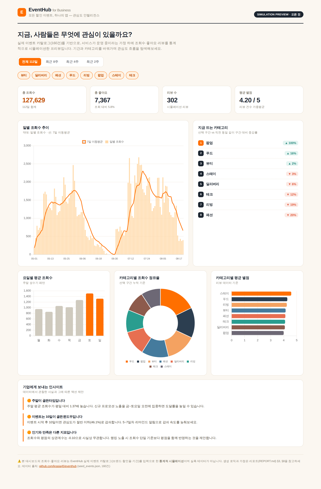
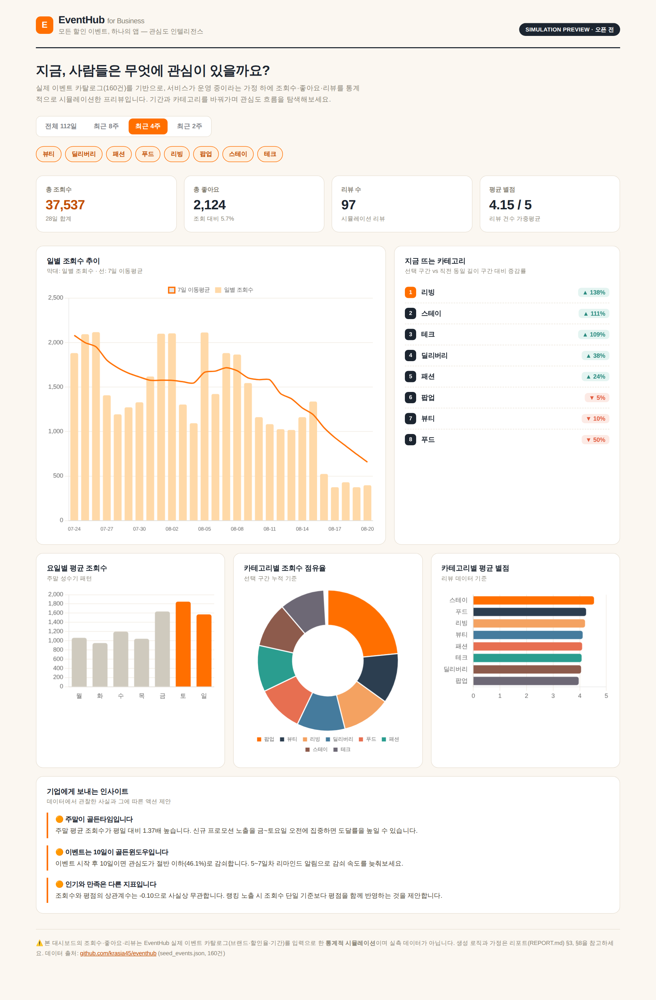
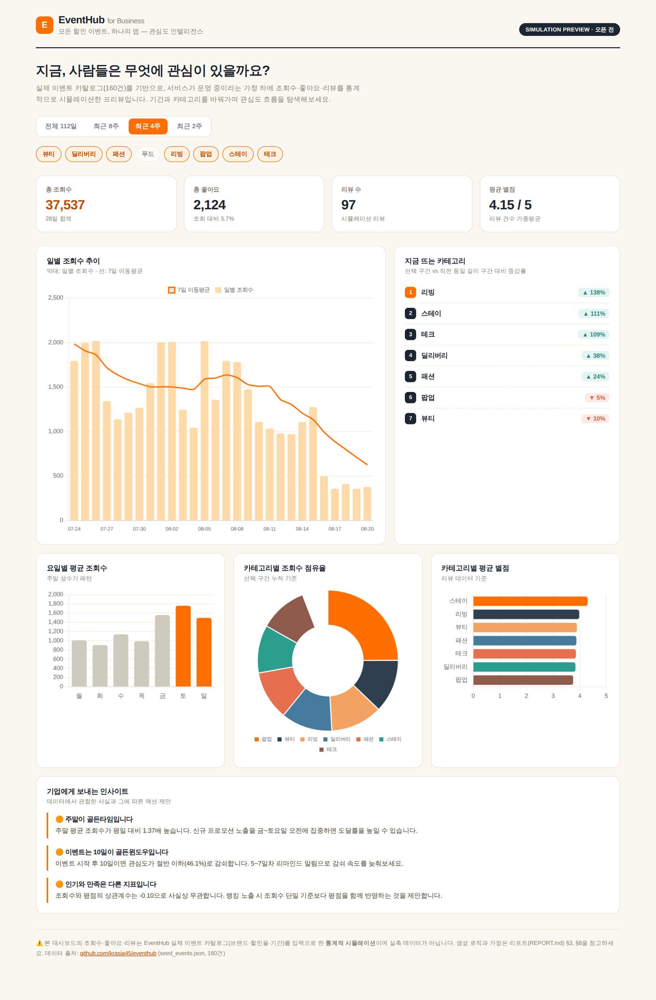

# [보너스] 서비스화 — 대시보드 스크린샷 & 시나리오

과제 요구사항의 "분석 결과 서비스화" 보너스는 3가지 제출 방식 중 택1입니다.
본 프로젝트는 **(3) 대시보드 스크린샷 세트 + 필터/기간 변경 시나리오 설명**으로
제출합니다 (실제 공개 배포는 하지 않았으나, `dashboard.html`은 완전히 동작하는
결과물이며 GitHub Pages 등에 그대로 올리면 (1) 배포 URL 방식으로도 전환 가능합니다).

> 스크린샷은 Playwright(Chromium 헤드리스)로 `dashboard.html`을 실제로 렌더링하고
> 버튼을 클릭해 상태를 바꿔가며 촬영한 것으로, 목업이 아니라 **실제 작동 화면**입니다.

---

## 시나리오 1 — 기본 화면 (전체 112일)

페이지를 열면 기본값으로 전체 분석 기간(112일)의 KPI(총 조회수 127,629 / 총 좋아요
7,367 / 리뷰 302건 / 평균 별점 4.20)와 일별 조회수 추이, "지금 뜨는 카테고리" 랭킹이
표시됩니다.

---

## 시나리오 2 — "최근 4주" 필터로 트렌드 좁혀보기

상단 `최근 4주` 버튼을 클릭하면:
- KPI가 즉시 해당 구간(28일) 기준으로 재계산됩니다 (총 조회수 37,537 등).
- "지금 뜨는 카테고리" 랭킹이 **REPORT.md §5-4에서 언급한 수치와 동일하게**
  최근 4주 vs 이전 4주 비교로 전환되어 리빙(+138%), 스테이(+111%), 테크(+109%)가
  상위에 뜨는 것을 확인할 수 있습니다.
- 일별 조회수 차트도 해당 구간만 확대되어 하강 추세(공급 공백 이후 물량 소진)가
  더 뚜렷하게 보입니다.

---

## 시나리오 3 — 카테고리 필터로 특정 카테고리 제외하기

카테고리 칩에서 `푸드`를 클릭해 비활성화하면:
- 카테고리별 점유율 도넛 차트, 평균 별점 바 차트, "지금 뜨는 카테고리" 랭킹에서
  푸드가 즉시 제외되고 나머지 7개 카테고리만 비교됩니다.
- 예: 브랜드 파트너가 "우리 카테고리(예: 리빙)를 다른 카테고리와 비교했을 때
  어떤가?"를 탐색할 때처럼, 특정 카테고리를 빼고 상대 비교하는 용도로 쓸 수 있습니다.

---

## 기술적으로 확인된 사항

- 순수 정적 HTML 파일 하나로 작동하며(데이터/Chart.js 라이브러리 전부 내장),
  **인터넷 연결이나 별도 서버 없이** 더블클릭만으로 실행됩니다.
- 실제 헤드리스 브라우저(Playwright/Chromium)로 렌더링해 콘솔 에러 0건을 확인했습니다.
- 필터 클릭 시 Chart.js 인스턴스가 매번 정리(destroy)된 후 다시 그려져 메모리 누수
  없이 반복 조작이 가능합니다.
- `scripts/build_dashboard.py --daily <실측 CSV> --mode real` 로 재실행하면
  코드 수정 없이 실측 데이터 버전으로 재생성됩니다 (README.md "실서비스 전환" 참고).
