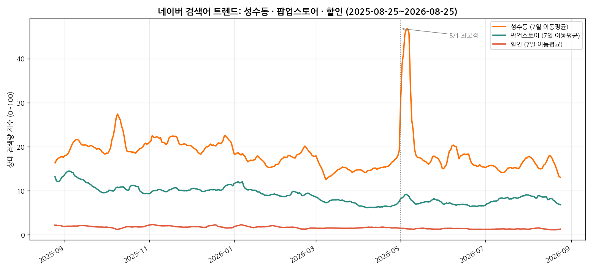
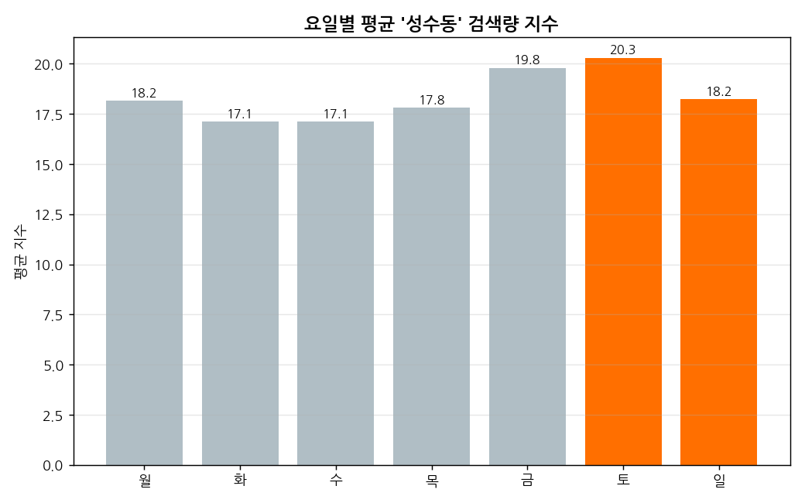
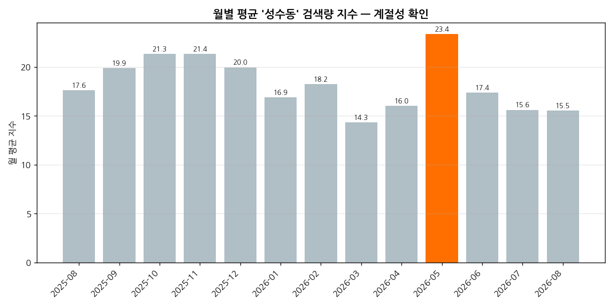
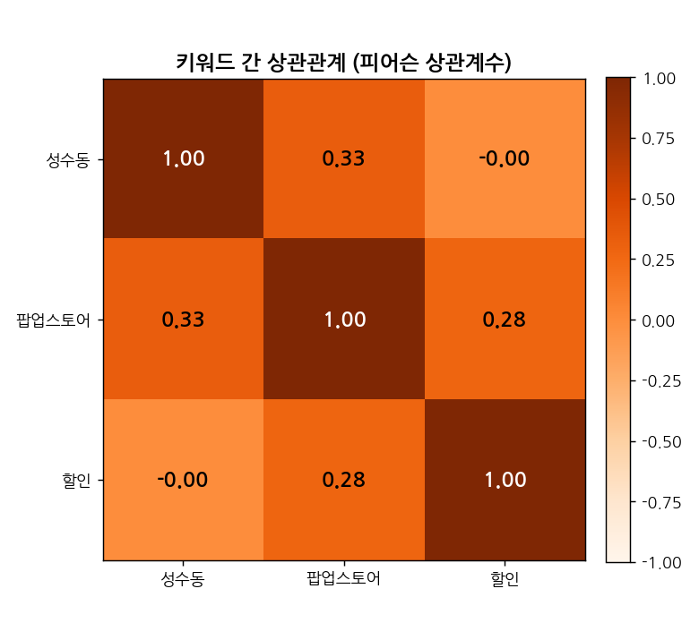
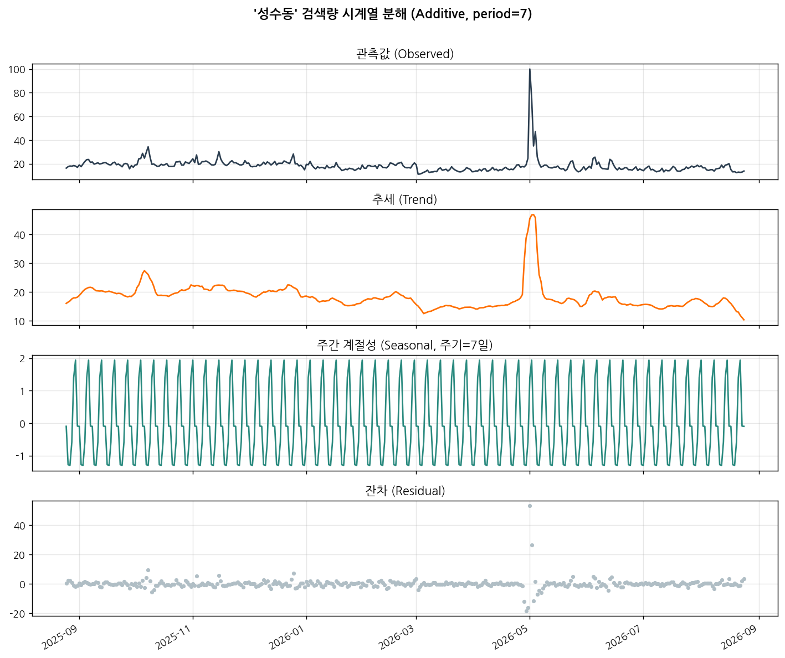
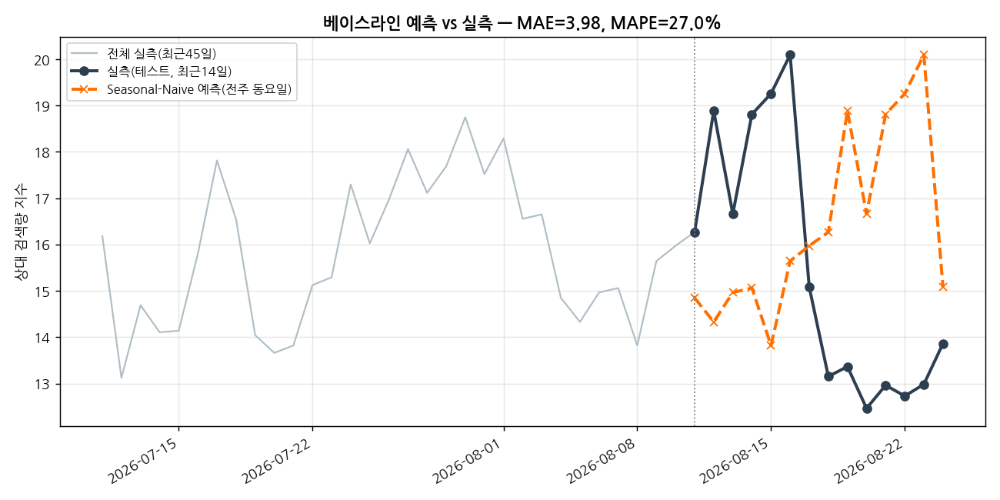

# 성수동 검색 트렌드 분석 리포트 (실제 데이터)

> AI 데이터 분석: 데이터 기반 트렌드 분석 — 미션 결과물 (실제 데이터 버전)

---

## 1. 분석 주제 및 선정 이유

**주제**: 네이버 검색 데이터로 본 '성수동' 대중 관심도 1년 추이 — EventHub 상권 배경
데이터로서의 실측 분석

이전 미션([`simulation-analysis/`](../simulation-analysis/))에서는 EventHub가 실제로
운영된다고 가정한 값을 사용했다. 이번에는 **실제로 지금 수집 가능한 진짜 데이터**로
같은 미션을 다시 수행한다. 성수동은 EventHub의 핵심 상권이라, 이 지역에 대한 대중의
실제 관심도 흐름을 아는 것은 사업 배경 데이터로서 직접적인 가치가 있다. 비교 대상으로
'팝업스토어'(성수동의 대표 콘텐츠)와 '할인'(EventHub의 핵심 가치)을 함께 조회해, 세
키워드가 어떻게 얽여 움직이는지도 함께 살펴본다.

---

## 2. 분석 질문 (4개)

1. '성수동' 검색 관심도는 요일에 따라 차이가 있는가?
2. '성수동' 검색 관심도는 계절(월)에 따라 어떤 패턴을 보이는가?
3. 특정 시점에 급등한 구간이 있다면 언제이고, 왜 그런 것으로 보이는가?
4. '성수동' 검색은 '팝업스토어'·'할인' 검색과 함께 움직이는가?

---

## 3. 데이터 설명

| 구분 | 내용 |
|---|---|
| 출처 | 네이버가 공식으로 제공하는 검색어 트렌드 API |
| 수집일 | 2026-08-25 |
| 기간 | 2025-08-25 ~ 2026-08-25 (365일, 일별) |
| 키워드 | 성수동 / 팝업스토어 / 할인 (3개 그룹, 1회 호출로 동시 수집) |
| 데이터 포인트 수 | **365개** (요구조건 100개 이상 충족) |
| 값의 의미 | 조회 구간 내 검색이 가장 많았던 날을 100으로 둔 상대 지수. 실제 검색
"건수"가 아니라 상대적인 관심도 추이를 나타낸다. |

> **라이선스/이용 주의**: 이 데이터는 네이버 오픈 API 이용약관에 따라 제공되는
> 상대 지수이며, 재판매나 원본 검색 로그 형태로의 재배포는 허용되지 않는다. 이
> 저장소에는 API가 반환한 집계 지수만 저장했다.

---

## 4. 데이터 정제

- **결측치**: 365일 전체에 결측 없음. 날짜 공백(빠진 날짜)도 0일 — API가 매일
  데이터를 안정적으로 제공했다.
- **이상치**: 사분위범위(대부분의 값이 몰려 있는 구간) 기준으로 성수동 10건,
  팝업스토어 5건, 할인 3건이 이 범위 밖으로 확인됐다. 이 값들은 측정 오류가 아니라
  실제 사건(연휴, 특정 이슈 등)을 반영할 가능성이 높다고 판단해 **제거하지 않고
  그대로 분석에 포함**했다.

---

## 5. 분석 결과 및 시각화

아래 그래프는 전부 같은 형식으로 설명한다 — **① 무엇을 그린 그래프인지 → ② 그래프에서
실제로 보이는 것(관찰) → ③ 왜 이런 모양이 됐을지(해석)** 순서다.

### 5-1. 전체 추이 (기법: 이동평균)

- **무엇을 봤는가**: 세 키워드의 하루하루 검색량을, 최근 7일 평균으로 부드럽게
  만들어 큰 흐름만 보이게 그렸다.
- **관찰**: 세 키워드 모두 대체로 완만한 흐름을 보이는 가운데, '성수동'만 **2026년
  5월 초에 극단적인 단기 급등**을 보인다. '팝업스토어'는 성수동과 비슷한 시기에
  소폭 동반 상승하지만 진폭은 훨씬 작다.
- **왜 이런 패턴일까**: 아래 5-3(월별), 인사이트 2에서 원인을 더 자세히 짚는다.

### 5-2. 요일별 평균 검색량 (기법: 요일별 집계)

- **무엇을 봤는가**: 365일치 '성수동' 검색량을 요일별로 묶어서 평균을 냈다.
- **관찰**: 토요일이 20.3으로 가장 높고 화·수요일이 17.1대로 가장 낮다. **주말
  평균이 평일 대비 약 1.13배** 높다.
- **왜 이런 패턴일까**: 성수동은 방문·나들이 목적의 관심이 큰 지역이라, 실제 방문
  계획을 세우는 주말 직전과 주말 당일에 검색이 몰리는 것으로 추정된다.

### 5-3. 월별 평균 검색량 (계절성)

- **무엇을 봤는가**: 365일치를 월별로 묶어서 평균을 냈다.
- **관찰**: 5월이 23.4로 가장 높고 3월이 14.3으로 가장 낮다. 봄(5월)과 가을(9~11월,
  19~21대)에 관심도가 높고 겨울~초봄(1~4월)에 낮아진다.
- **왜 이런 패턴일까**: 나들이하기 좋은 봄·가을에 관심이 몰리고, 추운 겨울~초봄에는
  상대적으로 관심이 가라앉는 계절 패턴으로 보인다.

### 5-4. 키워드 간 상관관계

- **무엇을 봤는가**: 세 키워드가 같은 날 같이 오르고 같이 내리는 정도(상관관계)를
  계산했다. 1에 가까울수록 완전히 같이 움직인다는 뜻이고, 0에 가까울수록 서로
  상관없이 움직인다는 뜻이다.
- **관찰**: 성수동-팝업스토어는 0.329(약한 동조), 성수동-할인은 -0.001(거의 무관).
- **왜 이런 패턴일까**: 성수동이 팝업스토어 성지로 알려진 것과 어느 정도 맞아떨어지지만
  강한 동조는 아니다. '할인'은 특정 지역과 무관하게 움직이는 범용 검색어라 성수동과
  따로 노는 것으로 보인다.

### 5-5. [보너스: 시계열 분해] 큰 흐름 / 요일 패턴 / 나머지 흔들림

- **무엇을 봤는가**: '성수동' 검색량을 세 가지로 나눠봤다 — 전체적으로 오르내리는
  큰 흐름(추세), 매주 반복되는 요일 패턴(계절성), 그 둘로 설명 안 되는 나머지
  흔들림(잔차).
- **관찰**: 매주 반복되는 요일 패턴이 뚜렷하다. 5월 초 급등은 큰 흐름에도 크게
  반영되고, 나머지 흔들림에서도 그 시점에만 유독 큰 값이 튄다.
- **왜 이런 패턴일까**: 요일 패턴으로는 설명이 안 되는 이례적인 사건이 5월 초에
  있었다는 뜻이다 — 인사이트 2에서 자세히 다룬다.

### 5-6. [보너스: 짧은 예측] 다음 값 예측해보기

- **무엇을 봤는가**: "이번 주 같은 요일 값은 지난주 같은 요일이랑 비슷하겠지"라는
  가장 단순한 방법으로, 최근 14일치를 미리 예측해보고 실제 값과 비교했다.
- **관찰**: 예측과 실제 값의 평균 오차는 3.98(오차율 27.0%)이었다 — 요일 패턴은
  어느 정도 맞추지만 정교하진 않다.
- **왜 이런 패턴일까**: '성수동' 검색량에는 요일 효과가 분명히 있지만, 그보다 더 큰
  변동(5월 급등 같은)은 요일 패턴만으로는 예측할 수 없는 불규칙한 사건이기 때문으로
  보인다. 예측 방법 자체의 문제라기보다, 이 데이터에 "매주 반복되는 패턴"과
  "가끔 튀는 이벤트성 변화"라는 서로 다른 두 가지 성질이 섞여 있다는 뜻이다.

---

## 6. 인사이트 (4개, 관찰 → 해석 → 액션)

**인사이트 1 — 주말 검색 관심도가 평일보다 뚜렷하게 높다**
- **관찰**: 토요일 평균 20.3, 평일(화~목) 평균 17.4. 주말/평일 배율 약 1.13배.
- **해석**: 성수동은 방문·나들이 목적의 관심이 큰 지역이라, 실제 방문 계획을 세우는
  주말 직전(금)과 주말 당일에 검색이 몰리는 것으로 추정된다.
- **액션**: 주말 방문객 대상 프로모션 노출을 금요일 오전~토요일에 집중.

**인사이트 2 — 2026년 5월 1일에 극단적인 검색량 급등이 있었다 (전체 기간 중 유일)**
- **관찰**: 5/1 원값 100(정규화 기준 최댓값), 7일 이동평균도 그 주에 46까지 치솟아
  평소(15~20대)의 2배 이상. 시계열 분해의 나머지 흔들림에서도 이 시점에만 +53까지 튐.
- **해석**: 5월 1일은 근로자의 날(공휴일)이자 봄나들이 성수기 시작 시점과 겹친다.
- **액션**: 유사한 연휴·행락철 시작일에 맞춰 사전 프로모션을 준비하면 자연 유입을
  활용할 수 있다.

**인사이트 3 — 5월이 월별 평균으로도 가장 높고, 계절적으로 완만한 흐름이 있다**
- **관찰**: 월평균 최고는 5월(23.4), 최저는 3월(14.3). 가을(9~11월)도 20 안팎으로
  비교적 높음.
- **해석**: 봄·가을 나들이 시즌에 관심이 몰리고, 겨울~초봄에는 상대적으로 가라앉는
  계절 패턴으로 보인다.
- **액션**: 3~4월처럼 관심도가 낮은 시기에는 할인 폭을 키운 이벤트로 방문 유인을
  보강.

**인사이트 4 — '성수동'과 '팝업스토어'는 약한 동조, '할인'과는 거의 무관하다**
- **관찰**: 성수동-팝업스토어 상관계수 0.329, 성수동-할인 상관계수 -0.001.
- **해석**: 성수동이 팝업스토어 성지로 알려진 것과 어느 정도 부합하지만 강한
  상관관계는 아니다. '할인'은 특정 지역과 무관하게 움직이는 범용 키워드로 보인다.
- **액션**: "할인"이라는 범용 마케팅 문구보다 "팝업스토어" 같은 성수동 특유의 맥락과
  결합한 메시지가 더 자연스러운 관심 급증과 맞물릴 가능성이 있다.

---

## 7. 결론 및 한계점

**결론**: '성수동' 검색 관심도는 뚜렷한 주말 효과와 봄/가을 계절성을 보이며, 2026년
5월 1일 같은 특정 연휴·행락철 시작 시점에 극단적인 단기 급등이 발생할 수 있다.
'팝업스토어'와는 약하게 동조하지만 '할인'과는 독립적으로 움직인다는 점에서, 성수동
관련 마케팅은 "할인" 프레이밍보다 "팝업/방문 경험" 프레이밍이 더 자연스러운 관심
급증과 맞물릴 가능성이 있다.

**한계점**:
1. 이 값은 절대 검색량이 아니라 조회 구간 내 상대 지수이므로, 이 결과를 다른
   기간·다른 키워드 조합과 절대 비교할 수 없다.
2. 상관관계 분석은 세 키워드가 함께 움직이는지만 보여줄 뿐 인과관계를 증명하지
   않는다.
3. 5월 1일 급등의 정확한 원인(공휴일 효과 vs 특정 이벤트)은 검색 데이터만으로는
   확정할 수 없고, 외부 뉴스/이벤트 데이터와 교차 검증이 필요하다.
4. 성별/연령/기기(PC·모바일)별 세분화는 이번 분석에 포함하지 않았다 — 같은 API로
   추가 분석이 가능하다.
5. 1년치 단일 관측이라, "5월 급등"이 매년 반복되는 패턴인지 올해만의 특이 현상인지는
   여러 해의 데이터가 쌓여야 확인할 수 있다.

---

## 8. AI 사용 로그 (필수)

- **사용 작업**: (1) 네이버 검색 트렌드 API 인증 오류 원인 진단 및 올바른 접속
  방법 확인, (2) 원본 데이터를 표 형태로 정리하는 코드 작성, (3) 시각화 6종
  스타일링, (4) 시계열 분해·짧은 예측 로직, (5) 인사이트 문장 초안 다듬기.
- **사용 이유**: 네이버가 최근 API 접속 방식을 바꾸며 접속 정보가 바뀐 것을
  확인하는 데 최신 정보 검색이 필요했고, 반복적인 집계/시각화 작업 시간을 절감하기
  위해 사용했다.
- **검증 방법**: (a) 실제로 받아온 원본 데이터를 다시 계산해 수치가 그대로 일치하는지
  확인, (b) 결측치·날짜 공백·이상치를 전수 검사해 데이터 품질 확인, (c) 상관계수·
  계절성 등 통계치를 요일/월/키워드 간 여러 각도에서 교차 확인해 해석이 일관되는지
  재검토했다.

---

## 부록. [보너스] 서비스화 — 통합 대시보드

이 분석은 [`docs/`](../docs/) 폴더의 통합 대시보드에서 시뮬레이션 분석과 함께
탭으로 전환하며 볼 수 있다 — 저장소 최상위 [`README.md`](../README.md)의 "대시보드"
항목 참고. 대시보드에서 기간·키워드를 바꿔가며 탐색할 수 있다.
