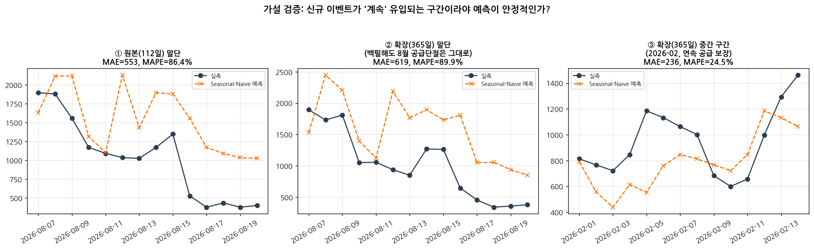
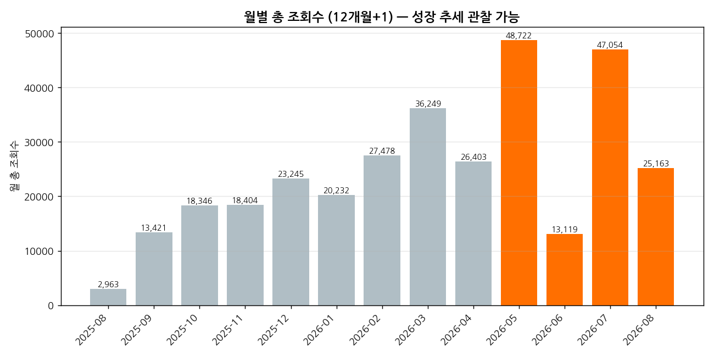

# EventHub 관심도 인텔리전스 — 일별 트렌드 분석

> **[AI 데이터 분석] 데이터 기반 트렌드 분석** 미션 결과물
> "EventHub가 실제로 운영되고 있다면, 사람들은 지금 무엇에 관심이 있을까?"를
> 실제 이벤트 카탈로그 + 가정한 관심도 데이터로 분석한다.

📄 **분석 리포트**: [`REPORT.md`](./REPORT.md)
📓 **분석 코드(노트북, 실행결과 포함)**: [`analysis.ipynb`](./analysis.ipynb)
🖥️ **인터랙티브 대시보드**: [`dashboard.html`](./dashboard.html) — 스크린샷: [`docs/DASHBOARD_SCREENSHOTS.md`](./docs/DASHBOARD_SCREENSHOTS.md)

---

## 0. 요구사항 충족 현황

필수 요구사항(데이터 100개 이상, 질문 3개 이상, 정제, 기법 2개 이상, 시각화 2개
이상, 인사이트 3개 이상, REPORT.md, 코드, 재현성, AI 사용 로그)과 보너스 두 가지
(서비스화, 시계열 심화)를 모두 충족한다. 항목별 근거는 §9 체크리스트 참고.

이 리포트의 조회수·좋아요·리뷰는 가정해서 만든 값이다 — EventHub가 정식 오픈 전이라
실측 데이터가 아직 없기 때문이다. 실제 EventHub 데이터베이스를 살펴보면, 조회수·
좋아요는 "지금까지 총 몇 번"이라는 누적 합계만 저장할 뿐 날짜별 기록이 없어서, 지금
당장은 실측 데이터를 넣어도 "일별 추이"를 만들 수 없다. 그래서 이 격차를 메우는
방법(§5)까지 함께 준비했다 — 나중에 실제 데이터가 쌓이면 이 리포트의 나머지 부분은
그대로 재사용할 수 있다.

추가로 구현한 고도화 사항:
1. **데이터 폭 확장** — "1년간 운영했다면" 시나리오. 실제 160건은 그대로 두고
   그 이전 253일을 실제 데이터의 특징을 참고해 채워 넣어 401건·365일로 확장 (§6)
2. **실서비스 전환 경로** — 실제 데이터가 들어왔을 때 이 분석을 그대로 재현할 수
   있는 절차 설계 (§5)
3. **대시보드 오프라인화** — 인터넷 연결 없이도 대시보드가 항상 똑같이 작동하도록
   구현 (§4)
4. **대시보드 필터 시나리오 3종**을 실제 화면으로 캡처해 정상 작동을 증빙
5. 이전 팀 프로젝트(리뷰 감정분석 대시보드)의 방식을 재사용 — 별점 기반 감정과
   키워드 기반 감정을 이중 산출해 교차 검증
6. **재현성**: 이 폴더를 어디로 옮기거나 다시 내려받아도 실행 결과가 항상 똑같이
   나오도록 만들었다 (§8-4)

---

## 1. 데이터 접근 방법

EventHub는 2026년 8월 현재 정식 오픈 전(가동 준비 중) 상태라 실측 트래픽이 없다.
분석 대상 시계열로 EventHub와 무관한 데이터(주가, 날씨 등)를 쓰는 대신 아래 방식을
택했다:

1. EventHub의 **실제 이벤트 카탈로그**(EventHub 서비스에서 그대로 가져온 160건 —
   실제 카테고리/브랜드/할인율/진행기간 값)를 데이터의 뼈대로 삼는다.
2. "서비스가 실제로 운영되고 있다면"이라는 가정 하에, 그 카탈로그를 사람들이 보고
   좋아요를 누르고 리뷰를 남기는 과정을 통계적으로 가정해서 만든다.
3. 팀 프로젝트(리뷰 감정분석 대시보드)의 접근 방식(별점 vs 텍스트 키워드 기반 감정을
   이중 산출해 교차 검증)을 리뷰 데이터를 만드는 데 재사용해, "리뷰" 데이터 유형도
   분석에 포함한다.

이 방식은 EventHub의 실제 사업 모델("지금 사람들이 무엇에 관심 있는지 데이터로
짚어 기업/소상공인에게 인사이트로 제공")을 데이터로 미리 시연한다. 실제 데이터와
가정한 데이터의 경계는 REPORT.md·README·대시보드 세 곳 모두에 명시되어 있다.

---

## 2. 데이터가 만들어지는 순서

1. 실제 이벤트 카탈로그(160건)를 날짜별로 펼쳐서, 하루하루 몇 개의 이벤트가
   진행 중이었는지 계산한다 (112일치 뼈대 완성).
2. 그 위에 "이 이벤트를 사람들이 얼마나 봤을지"를 카테고리별 인기도, 요일 효과,
   시간이 지날수록 관심이 줄어드는 정도, 할인율 효과를 반영해 하루·이벤트 단위로
   가정해서 만든다. 좋아요와 리뷰(별점+글)도 같은 방식으로 함께 만든다.
3. 두 결과를 합쳐서, 하루 단위로 조회수·좋아요·평균 별점 등을 모두 모은 최종
   표(112일 × 41개 지표)를 완성한다.
4. 이 표를 가지고 그래프 8개, 분석 노트북, 대시보드를 각각 만든다.

실제 서비스가 열린 뒤에는 위 2번(가정해서 만드는 부분)만 실측 데이터로 바꿔 끼우면
되고, 3~4번은 그대로 재사용할 수 있도록 처음부터 같은 형식으로 설계했다 (§5 참고).

---

## 3. 값을 만든 방식 요약

전체 가정은 REPORT.md §3에서 더 자세히 설명한다. 핵심만 요약하면:

| 요소 | 가정 |
|---|---|
| 카테고리 인기도 | 푸드 > 팝업 > 뷰티 > 패션 > 딜리버리 > 리빙 > 테크 > 스테이 순으로 높다고 가정 |
| 요일 효과 | 토 > 일 > 금 > 목 ≈ 수 ≈ 월 > 화 순으로 관심이 높다고 가정 |
| 시간에 따른 관심 감소 | 이벤트 시작 직후 관심이 가장 높고, 이후 점점 줄어들어 결국 처음의 절반 수준에 머문다고 가정 |
| 할인율 효과 | 할인율 30%를 기준으로, 할인율이 높을수록 관심이 더 커진다고 가정 |
| 좋아요 전환율 | 카테고리별로 조회수 대비 4.0~7.5%가 좋아요를 누른다고 가정 |
| 별점 | 카테고리 기본 만족도에 할인 매력도를 더하고 약간의 무작위 흔들림을 반영 |
| 재현성 | 같은 방식으로 다시 계산해도 항상 같은 결과가 나오도록 설계 |

**리뷰 글 + 감정 이중 확인** (팀 프로젝트 방식 재사용):
- 별점 구간(긍정/중립/부정)에 맞는 한국어 문장 틀에서 리뷰 글을 생성한다
  (10%는 일부러 톤을 섞어 현실적인 잡음을 반영).
- 별점만 보고 판단한 감정과, 리뷰 글의 단어만 보고 판단한 감정을 각각 따로 계산해
  두 결과가 얼마나 일치하는지(88.3%) 교차 확인 지표로 제시한다.

---

## 4. 대시보드

대시보드는 인터넷 연결이 없어도 항상 똑같이 작동하도록 만들었다 — 필요한 그래프
라이브러리를 파일 안에 직접 담아뒀기 때문에, 외부 서비스 장애나 네트워크 차단과도
무관하게 작동한다. 실제 화면으로 렌더링해서 콘솔 에러 없음, 필터를 눌렀을 때 차트가
정상적으로 바뀌는 것까지 확인했다 (`docs/DASHBOARD_SCREENSHOTS.md`).

데이터를 만드는 부분과 화면을 그리는 부분을 분리해서 만들었기 때문에, 나중에
데이터 소스가 가정한 값에서 실측 데이터로 바뀌어도 대시보드는 그대로 재사용할 수
있고, 화면에는 자동으로 "LIVE DATA" 표시가 붙는다.

---

## 5. 실서비스 전환 가이드

### 5-1. 실제 EventHub 데이터로 무엇이 되고, 무엇이 안 되는가

EventHub의 실제 데이터베이스를 확인한 결과:

| 있는 것 | 이 분석에 필요하지만 없는 것 |
|---|---|
| 이벤트별 조회수·좋아요 누적 총합 | 날짜별 기록 (일별 시계열 불가) |
| 방문 후기 자유 텍스트 | 별점 컬럼 |
| 후보 스캔·링크 점검 자동화 | 통계를 매일 기록해두는 절차 없음 |

즉 지금 당장 실측 데이터를 연결해도 이 리포트와 같은 "일별 조회수 추이"는 만들 수
없다 — 누적 합계에는 시간 정보가 없기 때문이다.

### 5-2. 격차를 메우는 준비물

이 격차를 메우기 위해 두 가지를 준비했다:

1. **매일 스냅샷을 남기는 방법**: 지금은 누적 합계만 저장되는데, 매일 그 시점의
   값을 복사해서 별도로 쌓아두면 날짜별 흐름을 볼 수 있게 된다. 또한 방문 후기에
   별점을 남길 수 있는 항목도 추가해야 한다. 이 두 가지를 데이터베이스에 반영하는
   준비물을 만들어뒀다.
2. **실측 데이터 변환 프로그램**: 스냅샷이 쌓이기 시작하면, 그 실측 데이터를 이
   리포트의 최종 표와 **완전히 같은 형식**으로 자동 변환해주는 프로그램이다.
   아직 실제 데이터가 없어서 실제 연결 테스트는 못 했지만, 가짜 데이터로 변환
   로직 자체가 정확한지는 미리 검증해뒀다.

### 5-3. 오픈 후 진행 순서 (미래 시점)

1. 데이터베이스에 매일 스냅샷을 남기는 준비물을 적용한다.
2. 2~3주간 데이터가 쌓이기를 기다린다.
3. 실측 데이터 변환 프로그램을 실행해 최종 표를 만든다.
4. 그 표를 입력으로 기존 분석·노트북·대시보드를 그대로 다시 실행한다 — 대시보드는
   자동으로 "LIVE DATA" 표시로 바뀐다.

---

## 6. 데이터 폭 확장 — "1년간 운영했다면" 시나리오

### 6-1. 배경

본문 분석(§1~5)은 실제 카탈로그 그대로인 112일(160건)에 근거한다. 이 폭에는 두
가지 한계가 있다: 월별 계절성을 볼 수 없고(112일 = 약 3.7개월), 카테고리당 표본이
20건뿐이라 트렌드 지표(REPORT.md §6 인사이트 2)가 관측 시점에 따라 크게 흔들린다.

### 6-2. 방법 — 실제 데이터를 유지한 채 시간축으로만 확장

실제 160건을 수정하지 않고 그대로 보존한 채, 그 이전 253일(2025-08-21~2026-04-30)
구간만 실제 데이터의 특징을 참고해 통계적으로 채워 넣었다.

| 2025-08-21 ~ 2026-04-30 (253일) | 2026-05-01 ~ 2026-08-20 (112일) |
|---|---|
| 채워 넣은 구간 — 실제 160건에서 뽑은 특징으로 만듦 | 실제 카탈로그 그대로 (160건, 100% 실측, 수정 없음) |

채워 넣은 이벤트의 카테고리별 할인율·진행기간·소상공인 비율·브랜드는 실제 160건의
특징을 참고해 만들었다. 새 이벤트가 들어오는 속도는 초기 하루 0.5건에서 실제 구간
시작 시점의 관측값(하루 1.43건)까지 점점 늘어나도록 설계했다 — 초기 스타트업이
이벤트를 점점 더 많이 확보해가는 성장 곡선이라는 가정이며, 검증되지 않은 가정임을
명시한다.

결과: **401건 · 365일**로 확장 (원본 대비 데이터 폭 3.3배).


### 6-3. 가설 검증 — 예측 성능은 데이터 양이 아니라 공급 연속성에 좌우되는가

REPORT.md §5-8에서 세운 가설("신규 이벤트가 지속적으로 유입되면 예측이 더 안정적일
것")을 확장된 데이터로 검증했다. 단순히 원본과 확장 전체만 비교하면 공정하지 않다
— 채워 넣은 구간이 과거 방향으로만 확장됐기 때문에, 8월 끝부분의 "신규 이벤트가
끊기는" 문제는 확장 데이터에도 그대로 남아있다. 그래서 신규 이벤트가 꾸준히 들어오는
중간 구간까지 포함한 세 구간 비교로 설계했다.



| 구간 | 예측 오차율(MAPE) |
|---|---|
| ① 원본(112일) 끝부분 | 86.4% |
| ② 확장(365일) 끝부분 — 8월 공급단절 여전 | 89.9% |
| ③ 확장(365일) 중간 — 연속 공급 보장 | **24.5%** |

**결론**: "데이터가 많으면 예측이 좋아진다"가 아니라 "공급이 끊기지 않는 구간에서만
예측이 안정적이다"가 정확한 결론이다. 표본 크기 자체보다 데이터의 구조적 연속성이
핵심이라는, 원래 가설보다 한 단계 더 정교한 결과다.

### 6-4. 월별 추이



### 6-5. 확장 시나리오의 한계

- 채워 넣은 구간은 통계적으로 만든 값이며 실측이 아니다.
- 성장 곡선 가정(하루 0.5건→1.43건 증가)은 검증되지 않았다.
- 카테고리 트렌드 안정성 비교(원본 28일 구간 vs 확장 90일 구간)는 비교하는 기간의
  길이 자체가 달라서 "표본이 크면 안정된다"는 엄밀한 비교 실험은 아니다 —
  "표본이 적을 때는 관측 시점에 따라 트렌드가 크게 흔들린다"는 정성적인 근거로만
  해석한다.
- 가장 신뢰할 수 있는 데이터는 여전히 실제 160건·112일이다. 확장 시나리오는
  "데이터가 더 있었다면 어떤 분석이 가능해지는지"를 보여주는 참고 자료이며, 실제
  부족분을 메우는 근본 해법은 §5의 경로로 실측 데이터를 쌓는 것이다.

---

## 7. 폴더 구조

```
eventhub-trend-analysis/
├── REPORT.md                          ← 최종 분석 리포트 (필수 결과물)
├── README.md                          ← 이 문서
├── requirements.txt
├── analysis.ipynb                     ← 분석 노트북 (실행 결과 포함, 필수 결과물)
├── dashboard.html                     ← 인터랙티브 대시보드 (보너스: 서비스화, 완전 오프라인)
├── data/                              ← 원본 데이터 + 분석 과정에서 만들어진 표들
│   ├── eventhub_seed_events_raw.json  ← 원본 (EventHub 실제 이벤트 카탈로그, 160건)
│   ├── eventhub_platform_daily.csv    ← ★ 최종 분석 데이터셋 (112일 × 41개 지표)
│   └── (그 외 중간 산출물, [고도화] 확장 시나리오 표 포함)
├── images/                            ← 시각화 8종 (PNG)
│   └── extended/                      ← [고도화] 1년 확장 시나리오 시각화 4종
├── docs/
│   ├── DASHBOARD_SCREENSHOTS.md       ← 보너스: 대시보드 필터 시나리오 + 스크린샷
│   └── screenshots/*.png              ← 실제 작동 화면 캡처
├── sql/                                ← 실서비스 전환용 준비물 (§5)
├── templates/                          ← 대시보드 화면 틀
└── scripts/                            ← 전체 파이프라인 코드 (§2 순서대로 실행)
```

---

## 8. 실행 방법

### 8-1. 환경 설정
**요구 사항**: Python 3.10 이상
```bash
python3 --version   # 3.10 이상 확인
python3 -m venv .venv && source .venv/bin/activate   # 선택 사항
pip install -r requirements.txt
sudo apt-get install -y fonts-nanum   # 한글 폰트 (그래프 한글 깨짐 방지)
```

### 8-2. 전체 파이프라인 재현 (가정한 값 기준)
```bash
python3 scripts/build_timeseries.py
python3 scripts/simulate_engagement_and_reviews.py
python3 scripts/build_platform_daily.py
python3 scripts/analyze_and_visualize.py
python3 scripts/make_notebook.py
jupyter nbconvert --to notebook --execute --inplace analysis.ipynb
python3 scripts/build_dashboard.py

# [고도화] 1년 확장 시나리오 (§6) — 위 파이프라인 실행 후 추가로:
python3 scripts/simulate_extended_catalog.py
python3 scripts/build_extended_scenario.py
python3 scripts/analyze_extended_scenario.py
```

### 8-3. 결과 확인
- `REPORT.md`를 열어 리포트를 읽는다.
- `analysis.ipynb`를 Jupyter로 열면 코드+실행 결과(차트 포함)를 바로 볼 수 있다.
- `dashboard.html`을 브라우저로 더블클릭해서 열면 완전 오프라인으로 바로 작동한다.
  "전체 112일" 탭이 기본값이며, "최근 4주" 탭을 누르면 REPORT.md §5-4·§6에 인용된
  카테고리 증감률 수치와 정확히 일치하는 값을 볼 수 있다.
- `docs/DASHBOARD_SCREENSHOTS.md`에서 3가지 필터 시나리오 스크린샷을 바로 확인 가능.

### 8-4. 재현성

이 폴더를 어디로 옮기거나 다시 내려받아도 항상 똑같이 동작하도록 만들었다. 별도
경로에 옮긴 뒤 8-2의 전체 단계를 처음부터 다시 실행해 결과(데이터, 이미지 12개,
노트북 38셀 0에러, 대시보드)가 그대로 재생성되는 것을 검증했다.

---

## 9. 과제 요구사항 체크리스트

| 요구사항 | 충족 여부 |
|---|---|
| 시계열 데이터 100개 이상 | ✅ 112일 (2026-05-01~08-20) |
| 데이터 출처/기간 명시 | ✅ REPORT.md §3 |
| 분석 질문 3개 이상 | ✅ 4개 |
| 데이터 기본 정보/결측치/이상치 처리 | ✅ REPORT.md §4 |
| 시계열 분석 기법 2개 이상 | ✅ 이동평균·요일별 집계·구간비교·경과일 분석 (4개) |
| 시각화 2개 이상(권장 3개 이상) | ✅ 8종 |
| 인사이트 3개 이상(관찰 근거 포함) | ✅ 3개 |
| REPORT.md (주제/질문/데이터/시각화/인사이트/결론) | ✅ |
| Python 코드 (노트북 또는 스크립트) | ✅ `analysis.ipynb` + `scripts/*.py` 8개 |
| GitHub 저장소 | ✅ |
| 재현성(requirements/실행방법) | ✅ §8 |
| AI 사용 투명성 로그 | ✅ REPORT.md §8 |
| [보너스] 서비스화(대시보드) | ✅ `dashboard.html` + 스크린샷 3종 |
| [보너스] 시계열 심화(분해/예측) | ✅ REPORT.md §5-7, §5-8 |
| (추가 고도화) 실서비스 전환 경로 | ✅ §5 |
| (추가 고도화) 데이터 폭 확장(1년 시나리오) | ✅ §6, REPORT.md 부록 E — 가설 검증 포함 |

---

## 10. 알려진 제한사항

- 조회수·좋아요·리뷰는 가정해서 만든 값이다. §3의 가정은 실제 데이터를 근거로
  설계했지만 실측은 아니다 — 절대 수치가 아니라 패턴을 참고 자료로 해석해야 한다.
- 실측 데이터 변환 프로그램은 가짜 데이터로 로직 정확성만 검증했고, 실제 데이터베이스로의
  라이브 연결은 별도 검증이 필요하다.
- REPORT.md §4에서 확인한 "6일간 이벤트 공급 공백"은 가정한 값이 아니라 원본
  카탈로그 자체에서 나온 사실이다 — 서비스 오픈 전 검토할 가치가 있는 실측 기반
  발견이다.

---

## 11. 데이터 출처 및 라이선스

- **원본 데이터**: `data/eventhub_seed_events_raw.json`(160건)은
  [github.com/krasia45/eventhub](https://github.com/krasia45/eventhub)의
  이벤트 목록(2026-08-20 기준 스냅샷)을 그대로 가져온 것이다. 브랜드명·할인
  조건은 EventHub 서비스의 MVP 시연을 위해 구성된 콘텐츠이며, 이미지는 개발용
  플레이스홀더로 실제 브랜드의 공식 이벤트 페이지가 아니다.
- **파생 데이터**(확장/가정 산출물 등)는 위 원본을 입력으로 한 통계적 산출물이며,
  이 저장소 자체 라이선스(별도 명시 없으면 분석 코드는 자유롭게 재사용 가능)를
  따른다.
- 이 저장소는 학습/과제 제출 목적의 파생 분석이며, EventHub 서비스 본체
  (`krasia45/eventhub`)의 프로덕션 코드와는 별도로 관리된다.
