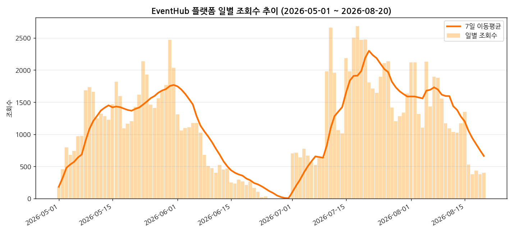
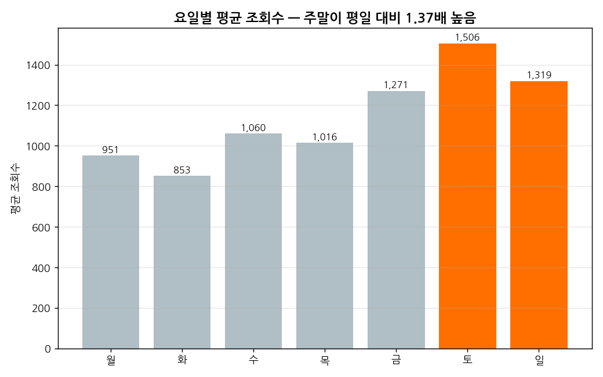
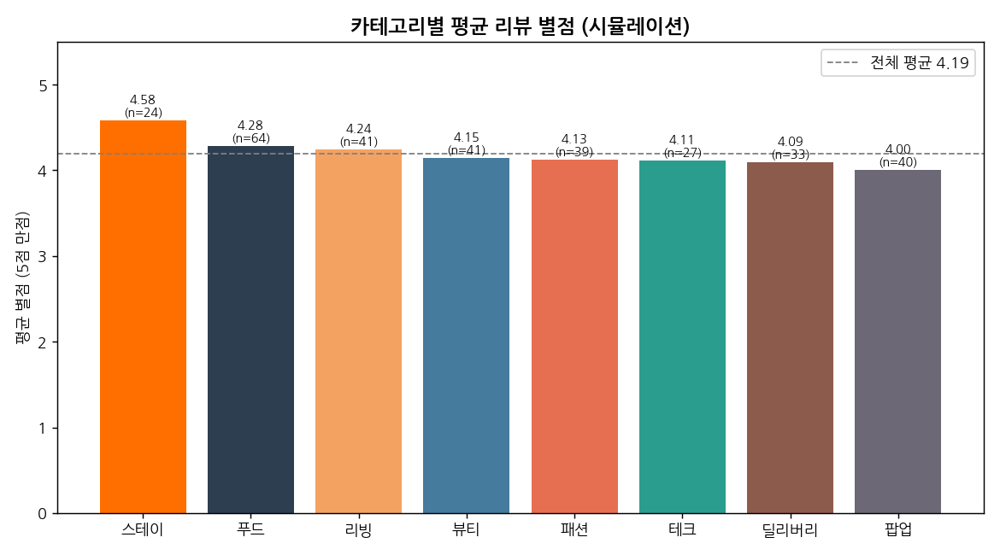
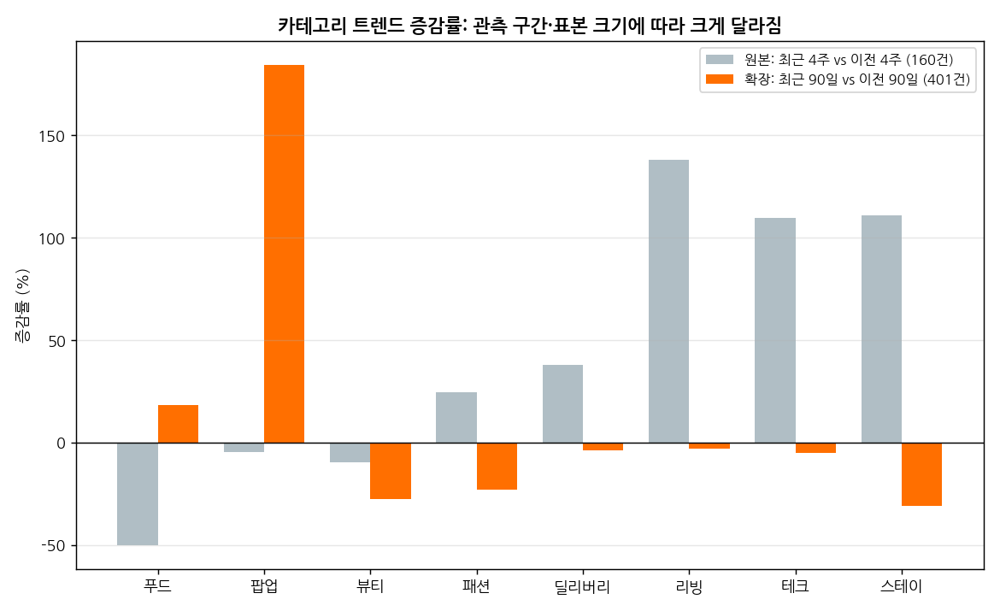

# EventHub 일별 관심도(조회수) 트렌드 분석 리포트

> AI 데이터 분석: 데이터 기반 트렌드 분석 — 미션 결과물

---

## 1. 분석 주제 및 선정 이유

**주제**: "만약 EventHub가 지금 실제로 운영되고 있다면, 사람들은 어떤 할인 이벤트에 관심을
갖고 있을까?" — 플랫폼 일별 조회수·좋아요·리뷰(별점) 시계열 분석

EventHub는 소비자·기업·소상공인·외국인 관광객을 연결하는 4면 discount-event 플랫폼으로,
"브랜드별 전수 큐레이션과 실시간 인기 랭킹"을 핵심 가치로 제공하는 것을 목표로 한다.
즉 **"지금 사람들이 무엇에 관심 있는지"를 데이터로 짚어내 기업/소상공인에게 인사이트로
되돌려주는 것**이 서비스의 핵심 경쟁력이다.

다만 2026년 8월 현재 EventHub는 정식 오픈 전(가동 준비 중) 단계라 실측 트래픽이 없다.
그래서 이 분석은 **실제 이벤트 카탈로그(160건, EventHub 서비스에서 그대로 가져옴)를
기준으로, "서비스가 실제로 돌아가고 있다면" 발생했을 법한 사용자 관심도를 통계적으로
가정**하고, 그 흐름을 분석했다. 카테고리, 브랜드, 할인율, 진행 기간은 모두 실제
카탈로그 값이며, 조회수·좋아요·리뷰만 가정한 값이다 — 이 구분을 §3, §7에서 투명하게
밝힌다.

---

## 2. 분석 질문 (4개)

1. 플랫폼 전체 **일별 조회수**는 어떤 추세와 요일 패턴을 보이는가?
2. 어떤 **카테고리가 최근 상승세(트렌딩)**를 보이는가? — 기업에게 어떤 카테고리·타이밍에
   프로모션을 제안할 수 있는가?
3. 이벤트 시작 이후 관심도는 **어떻게 감쇠**하는가(노벨티 효과)? 이벤트 운영 전략(리마인드
   알림 등)에 어떤 시사점을 주는가?
4. 리뷰 데이터의 **만족도(별점)**는 카테고리별로 다른가? 관심도(조회수)와 만족도(평점) 사이에
   상관관계가 있는가?

---

## 3. 데이터 설명

| 구분 | 내용 |
|---|---|
| 원본 데이터 | EventHub 서비스의 실제 이벤트 카탈로그 (160건) |
| 실제 필드 | 카테고리(8종), 브랜드, 할인율, 진행 기간, 브랜드/소상공인 구분 등 |
| 파생 시계열 | 레코드 단위 데이터를 일자별로 펼쳐 **112일**(2026-05-01~2026-08-20) 일별 시계열 생성 |
| 가정한 값 | 조회수·좋아요·리뷰(별점/텍스트)는 카테고리별 인기도·요일 효과·시간 경과에 따른 관심 감소·할인율 효과를 반영해 통계적으로 만들었다. 같은 방식으로 다시 계산해도 항상 같은 결과가 나오도록 설계했다(재현 가능). |
| 데이터 포인트 수 | **112개** (요구조건 100개 이상 충족) |
| 산출 규모 | 총 조회수 127,629 / 총 좋아요 7,367 / 리뷰 302건 |

**값을 만든 방식 요약**:

- 카테고리별 기본 관심도가 다르다고 가정했다 (푸드·팝업·뷰티가 상대적으로 인기가
  많다고 가정).
- 주말(토·일) 트래픽이 평일보다 높다고 가정했다.
- 이벤트는 시작 직후 관심도가 가장 높고 이후 점점 식는 패턴을 가진다고 가정했다.
- 할인율이 높을수록(30% 기준) 조회 유인이 커진다고 가정했다.
- 좋아요/리뷰 발생량은 조회수에 비례하되 카테고리별로 전환율이 다르다고 가정했다.
- 별점은 카테고리 기본 만족도와 할인 매력도를 반영해 만들었고, 리뷰 문장은 별점
  구간별 문장 틀에서 생성했다(10%는 일부러 톤을 섞어 현실적인 잡음을 반영).

> 이 데이터는 **실측이 아닌 가정한(합성) 데이터**다. 절대 수치보다 **패턴·구조**를
> 중심으로 해석해야 한다 (§7 한계점 참고). 단, §4의 "공급 공백기" 발견은 가정한 값이
> 아닌 **원본 카탈로그 자체에서 나온 실제 사실**이다.

> **데이터 출처/라이선스 주의**: 원본 카탈로그의 브랜드명·할인 조건은 EventHub 서비스
> MVP 시연용으로 구성된 콘텐츠이며, 이미지 URL은 개발용 플레이스홀더로 실제 브랜드의
> 공식 페이지가 아니다. 자세한 내용은 README.md §11 참고.

---

## 4. 데이터 정제

- 별점이 비어있는 날은 그날 리뷰가 0건이라는 뜻으로, 정상적인 '무응답'이다. 단순
  일별 평균 대신 **최근 7일치를 기준으로 한 가중 평균**을 별도로 계산해, 그날 리뷰
  수가 적어서 생기는 왜곡을 줄였다.
- 이벤트 진행 기간이 음수이거나 60일을 초과하는 이상치가 있는지 전수 검사했다 →
  **0건, 이상치 없음**.
- 활성 이벤트가 0건인 날짜(공급 공백일)를 찾았다 → 2026-06-25~06-30, **6일간**
  (§7 결론에서 이 발견의 의미를 다룬다).

---

## 5. 분석 결과 및 시각화

아래 그래프는 전부 같은 형식으로 설명한다 — **① 무엇을 그린 그래프인지 → ② 그래프에서
실제로 보이는 것(관찰) → ③ 왜 이런 모양이 됐을지(해석)** 순서다.

### 5-1. 일별 조회수 추이 (기법: 이동평균)

- **무엇을 봤는가**: 매일의 조회수를 그대로 그리면 하루하루 들쭉날쭉해서 큰 흐름이
  안 보인다. 그래서 최근 7일씩 평균을 낸 선을 함께 그려 큰 흐름만 보이게 했다.
- **관찰**: 5월 초 서비스 시작 후 조회수가 상승했다가, 1차로 등록된 이벤트들이 끝나며
  6월 하순 거의 0까지 떨어지고, 7월에 새 이벤트가 등록되며 다시 크게 올랐다가 이후
  완만히 줄어든다.
- **왜 이런 패턴일까**: 이벤트 '물량'이 한 번에 들어왔다가 소진되고, 다시 채워지는
  주기를 그대로 반영한 것으로 보인다.

### 5-2. 요일별 평균 조회수 (기법: 요일별 집계)

- **무엇을 봤는가**: 112일치 데이터를 요일별로 묶어서 평균을 냈다.
- **관찰**: 토요일이 1,506회로 가장 높고, 화요일이 853회로 가장 낮다. **주말 평균이
  평일 평균의 1.37배**다.
- **왜 이런 패턴일까**: 시간 여유가 많은 주말에 할인 정보를 찾아보는 사람이 많을
  것이라는 가정이 반영된 결과다.

### 5-3. 카테고리별 조회수 점유율

- **무엇을 봤는가**: 전체 조회수 중 각 카테고리가 차지하는 비중을 계산했다.
- **관찰**: 푸드(17.8%), 팝업(14.2%), 뷰티(14.2%) 순으로 비중이 높다.
- **왜 이런 패턴일까**: 카테고리별로 사람들의 기본 관심도가 다르다고 가정한 부분이
  그대로 반영된 결과다.

### 5-4. 카테고리별 트렌딩 (기법: 최근 4주 vs 이전 4주 비교)

- **무엇을 봤는가**: 가장 최근 4주와 그 이전 4주의 조회수를 카테고리별로 비교해,
  얼마나 늘거나 줄었는지 계산했다.
- **관찰**: 리빙(+138%), 스테이(+111%), 테크(+109%)는 크게 늘었고, 푸드(-50%)는
  크게 줄었다.
- **왜 이런 패턴일까**: 카테고리마다 이벤트가 20건 정도로 적다 보니, 이벤트 한두 개가
  시작하거나 끝나는 시점에 따라 숫자가 크게 출렁인 것으로 보인다. 즉 진짜 유행이
  바뀐 것이라기보다, 표본이 적어서 생긴 흔들림일 가능성이 크다 (§7 한계점 참고).

### 5-5. 노벨티 감쇠 곡선 (기법: 시작 후 경과일별 평균)

- **무엇을 봤는가**: 이벤트가 시작된 날을 0일차로 놓고, 그 후 며칠이 지났는지에 따라
  평균 조회수가 어떻게 변하는지 그렸다.
- **관찰**: 시작 당일(0일차) 평균 84.4회 → 10일 뒤(10일차) 38.9회로, **10일 만에
  절반 이하(46.1%)로 떨어진다**.
- **왜 이런 패턴일까**: 새로 올라온 이벤트일수록 눈에 더 잘 띄고, 시간이 지날수록
  다른 새 이벤트에 밀려 화면에서 덜 보이게 되기 때문으로 추정된다.

### 5-6. 카테고리별 평균 별점

- **무엇을 봤는가**: 카테고리별로 리뷰 별점의 평균을 계산했다.
- **관찰**: 스테이(4.58점)가 가장 높고 팝업(4.00점)이 가장 낮다.
- **왜 이런 패턴일까**: 카테고리별 기본 만족도를 다르게 가정한 부분이 반영된 결과다.

### 5-7. [보너스: 시계열 분해] 큰 흐름 / 요일 패턴 / 나머지 흔들림

- **무엇을 봤는가**: 하루하루의 조회수를 세 가지로 나눠봤다 — 전체적으로 오르내리는
  큰 흐름(추세), 매주 반복되는 요일 패턴(계절성), 그리고 그 둘로 설명 안 되는 나머지
  흔들림(잔차).
- **관찰**: 매주 반복되는 요일 패턴이 뚜렷하게 나타난다. 나머지 흔들림의 크기는
  전체 평균(1,140회)의 약 20% 수준이다.
- **왜 이런 패턴일까**: 요일 패턴은 5-2번 그래프(주말 효과)와 같은 이야기고, 큰 흐름은
  5-1번 그래프에서 본 "이벤트 물량 사이클"(5~6월, 7~8월 두 번)을 그대로 보여준다.

### 5-8. [보너스: 짧은 예측] 다음 값 예측해보기

- **무엇을 봤는가**: "이번 주 화요일 값은 지난주 화요일이랑 비슷하겠지"라는 가장
  단순한 방법으로, 최근 14일치를 미리 예측해보고 실제 값과 비교했다.
- **관찰**: 예측이 실제 값과 평균 553.3 정도 차이가 났다(오차율 86.4%). 오히려
  "어제 값을 오늘도 그대로 쓴다"는 더 단순한 방법(오차 197.1)보다 결과가 나빴다.
- **왜 이런 패턴일까**: 예측이 빗나간 구간(8월 7일~20일)이 하필 "새 이벤트가 더 이상
  등록되지 않아 조회수가 계속 줄어드는" 구간과 겹쳤기 때문으로 보인다. 이건 예측
  방법 자체의 문제라기보다, 이 데이터가 "정해진 개수의 이벤트 목록"에서 나온 것이라
  생기는 한계에 가깝다 — 실제 서비스처럼 새 이벤트가 꾸준히 올라온다면 이 방식의
  예측이 더 안정적일 것으로 예상된다 (부록 E에서 실제로 검증했다).

---

## 6. 인사이트 (3개, 관찰 → 해석 → 액션)

**인사이트 1 — 주말 관심도가 평일 대비 1.37배 높다**
- **관찰**: 주말 평균 조회수 1,412 vs 평일 평균 1,030 (토요일 최고 1,506).
- **해석**: 여유 시간이 많은 주말에 할인 이벤트 탐색/방문 수요가 몰리는 것으로 추정.
- **액션**: 신규 이벤트 노출(푸시·배너)을 금~토요일 오전에 집중 배치.

**인사이트 2 — '리빙·스테이·테크'가 최근 급상승, '푸드'는 급락**
- **관찰**: 최근 4주 대비 이전 4주 리빙 +138%, 스테이 +111%, 테크 +109%, 푸드 -50%.
- **해석**: 카테고리당 표본이 20건으로 적어 개별 이벤트 시작/종료 타이밍에 민감하게 반응한
  결과일 가능성이 크며, 확정적 트렌드로 단정하기엔 표본이 부족하다.
- **액션**: 실서비스에서는 표본이 커지므로 이 지표를 주간 대시보드화해 "지금 뜨는 카테고리"
  인사이트로 브랜드/소상공인에게 제공하고 프로모션 슬롯 우선순위에 반영.

**인사이트 3 — 이벤트는 시작 후 10일 내 관심도가 절반 이하로 감쇠한다**
- **관찰**: 0일차 84.4회 → 10일차 38.9회 (46.1% 수준).
- **해석**: '한정 기간' 신선함 효과가 초반에 집중되고 이후 피드에서 밀려나기 때문으로 추정.
- **액션**: 이벤트 중반(5~7일차)에 리마인드 알림·재노출을 넣어 감쇠 곡선을 완만하게 조정.

---

## 7. 결론 및 한계점

**결론**: EventHub 이벤트 카탈로그를 기반으로 한 관심도 분석에서 ①주말 성수기 패턴,
②이벤트 노벨티 감쇠, ③카테고리별 트렌드 로테이션이라는 세 가지 뚜렷한 시계열 구조를
확인했다. 특히 §4에서 확인한 '6일간의 공급 공백기'는 가정한 값이 아닌 실제 데이터에서
나온 발견으로, 서비스 오픈 전 지금 바로 반영 가능한 실행 인사이트다. 이 구조를 실제
서비스 오픈 후 관측 데이터로 재검증할 수 있다면, "지금 뜨는 이벤트/카테고리"를
브랜드·소상공인에게 제공하는 EventHub의 핵심 인사이트 상품(실시간 인기 랭킹)의 데이터
기반을 마련할 수 있다.

**한계점**:
1. 조회수·좋아요·리뷰는 실제 운영 데이터가 아닌 **가정한 값**이다. 카테고리별 인기도·
   요일 효과 등은 합리적인 가정이지 실측값이 아니므로 절대 수치보다 패턴을 참고해야 한다.
2. 분석 기간이 112일(약 16주)로 짧아 월별 계절성·장기 추세를 판단하기엔 데이터가 부족하다.
3. 카탈로그 자체가 특정 시점 스냅샷이라 후반부에 신규 이벤트가 끊기는 인공적 하강 구간이
   존재해 예측 성능 평가(§5-8)를 왜곡할 수 있다.
4. 카테고리별 표본이 20건으로 적어 트렌드 증감률(인사이트 2)은 노이즈에 민감하다.
5. 소상공인 이벤트 비중이 13.75%(조회수 기준 12.4%)로 낮아, 4면 플랫폼 중 '소상공인 지원'
   축의 데이터가 상대적으로 얇다 — 향후 소상공인 온보딩 확대가 필요하다.
6. **다음 단계**: 실제 서비스 오픈 후 실측 데이터로 본 분석을 그대로 재실행해 가정한
   값과 실측 사이의 차이를 검증한다.

> 위 한계점 중 2번(분석 기간이 짧음)과 4번(카테고리별 표본 부족)은 **부록 E**에서
> 1년 확장 시나리오로 정면 대응했다 — 완전히 해소되진 않지만, 어디까지 개선되고
> 어디서부터는 여전히 한계인지를 구체적으로 검증했다.

---

## 8. AI 사용 로그 (필수)

- **사용 작업**: (1) 원본 데이터를 일별 시계열로 바꾸는 초안 작성, (2) 관심도/리뷰
  값을 만드는 방식 설계 및 검증, (3) 시각화 8종 스타일링, (4) 시계열 분해·짧은 예측
  로직, (5) 인사이트 문장 초안 다듬기.
- **사용 이유**: 반복적인 집계·시각화 작업 시간 절감, 시계열 분해 방법 사용법 확인
  및 대안 탐색, 이전 팀 프로젝트(리뷰 감정분석 대시보드)의 키워드 기반 감정 분석
  방식을 재사용하기 위한 참고.
- **검증 방법**: (a) 생성된 결과를 전부 직접 실행하고 수치를 원본 카탈로그와 대조 (예:
  활성 이벤트 0건 구간을 원본 이벤트의 진행 기간 값과 재대조), (b) 별점 기반 감정과
  텍스트 키워드 기반 감정을 이중 산출해 일치율(88.3%)을 교차 검증, (c) 결과 요약
  통계(평균/분산/상관계수)가 처음 설계 의도(요일 효과, 카테고리별 인기도)와 방향이
  일치하는지 재확인.

---

## 부록 A. [보너스] 서비스화 — 인터랙티브 대시보드

분석 결과를 브랜드 파트너가 기간·카테고리를 바꿔가며 탐색할 수 있는 웹 대시보드로
구현했다. 별도 설치나 인터넷 연결 없이 파일을 더블클릭하면 바로 실행되며, 실제
헤드리스 브라우저로 렌더링해 3가지 필터 시나리오(전체 기간 / 최근 4주 / 카테고리
제외)를 스크린샷으로 검증했다 (`docs/DASHBOARD_SCREENSHOTS.md`). 입력 데이터만
바꾸면 실측 데이터가 들어왔을 때도 그대로 재사용할 수 있게 만들었다 (부록 D 참고).

## 부록 B. [보너스] 시계열 심화 — 분해 & 예측

§5-7(시계열 분해), §5-8(짧은 예측)에서 수행했다.

## 부록 D. 실서비스 전환 — "실제로 EventHub가 운영된다면"에 대한 답

이 리포트 전체는 **가정한 값을 쓴 분석**이라는 한계를 가진다. 이를 실제로 해소하기
위해 두 가지를 추가로 준비했다 (자세한 내용은 README.md "실서비스 전환 가이드" 참고):

1. 실제 EventHub 데이터베이스에는 조회수·좋아요가 "지금까지의 총합"으로만 저장돼
   있어 날짜별 흐름을 볼 수 없다. 그래서 매일 스냅샷을 남기는 방식을 새로 제안했다 —
   실제 구조를 조사해 "지금 이 분석을 실측 데이터로 재현하려면 무엇이 빠져 있는가"를
   정확히 짚어낸 결과물이다.
2. 그 스냅샷이 쌓이기 시작하면, 실제 데이터를 이 리포트와 **완전히 같은 형식**으로
   변환해주는 프로그램도 함께 준비해뒀다. 네트워크 연결 없이도 이 변환 로직이 맞게
   동작하는지 미리 검증까지 마쳤다.

즉 이 분석은 "가정으로 끝"이 아니라, **실측 데이터가 들어왔을 때 그대로 재사용
가능한 절차**까지 준비되어 있다.

## 부록 E. [고도화] 데이터 폭 확장 — "1년간 운영했다면" 시나리오

**문제의식**: 본문 분석은 실제 카탈로그 그대로인 112일(160건)에 근거한다. 이 폭으로는
① 월별 계절성을 볼 수 없고 ② 카테고리당 표본(20건)이 작아 트렌드 지표(§6 인사이트 2)가
노이즈에 민감하다는 한계가 있었다.

**접근**: 실제 160건은 **단 1건도 수정하지 않고 그대로 보존**한 채, 그 이전
253일(2025-08-21~2026-04-30)을 실제 데이터의 특징(카테고리별 할인율 분포·진행
기간 분포·소상공인 비율·실제 브랜드 풀)을 참고해 통계적으로 채워 넣어 총
**401건·365일**로 확장한 시나리오를 별도로 만들었다. 신규 이벤트가 들어오는 속도는
초기 하루 0.5건에서 실제 구간 시작 시점의 관측값(하루 1.43건)까지 점점 늘어나도록
설계했다(초기 스타트업이 이벤트를 점점 더 많이 확보해가는 성장 곡선이라는 가정).

**가설 검증**: §5-8에서 제기한 가설("신규 이벤트가 지속적으로 유입되면 예측이 더
안정적일 것")을 세 구간으로 공정하게 나눠 테스트했다 — ① 원본(112일) 끝부분,
② 확장(365일)에서도 여전히 신규 이벤트가 끊기는 끝부분, ③ 확장(365일) 중에서
신규 이벤트가 꾸준히 들어오는 중간 구간.

| 구간 | 예측 오차율(MAPE) |
|---|---|
| ① 원본(112일) 끝부분 | 86.4% |
| ② 확장(365일) 끝부분 — 신규 이벤트 단절 여전 | 89.9% |
| ③ 확장(365일) 중간 — 신규 이벤트 꾸준히 유입 | **24.5%** |

②는 ①과 거의 같지만(오히려 소폭 나빠짐) ③은 크게 좋아진다. **"데이터가 많으면
예측이 좋아진다"가 아니라 "신규 이벤트가 끊기지 않는 구간에서만 예측이 안정적이다"**가
정확한 결론이다 — 단순히 기간을 늘리는 게 아니라, 데이터가 꾸준히 이어지는지가
핵심이라는, 처음 가설보다 한 단계 더 정교해진 인사이트를 얻었다.

**월별 추이** (이제 가능해진 계절 관찰):

**카테고리 트렌드 안정성 비교** (원본 28일 구간 vs 확장 90일 구간):

**정직한 한계**: 백필 구간(과거로 채워 넣은 부분)은 통계적으로 만든 값이며 실측이
아니다. 성장 곡선(하루 0.5건→1.43건) 가정은 검증되지 않았다. 카테고리 트렌드
비교(원본 28일 구간 vs 확장 90일 구간)는 비교하는 기간의 길이 자체가 달라서 엄밀한
비교 실험은 아니며, "표본이 적을 때는 관측 시점에 따라 트렌드가 크게 흔들린다"는
정성적인 근거로만 해석해야 한다.
